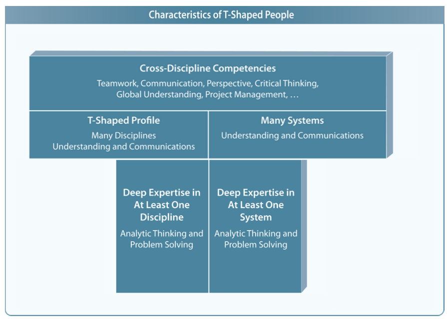

# Module 3 - Knowing DevOps for Individuals

## Objectives

* Understand the role of T-shape profiles.
* Explain the essence of T-shape profiles for DevOps professionals.
* Know about the 12 capabilities required for a DevOps professional.
* Know about the various DevOps certifications offered by DASA.

---

## Topic 1 - T-Shape Profiles

### **No Role Silo**

No Role Silo is about breaking the role-specific silos. 

The fundamental problem was the role-specific nature of people. That's why DevOps discourage working in silos and following the Waterfall approach.

Answering 5 fundamental questions can help you understand the idea behind discouraging silos:

1. **When do silos occur?**

Structuring the various departments of an organization to focus on specific goals instead of the organizational objectives creates silos.

2. **What is the fundamental problem?**

Silos lead to opposed relationships between various departments. Such relationships abstract people away from the consequences of their actions. The result is a reduced level of efficiency.

3. **Why does the problem occur?**

Abstracting people away from the consequences of their actions push them to practice bad behavior. It happens as silos do not allow information-sharing, transparency, and effective communication. As a result, different teams stay away from forming trust and mutual respect.

The absence of a trustworthy and open information-sharing system leads to delayed workflow and an increased level of misinterpretations. As a result, silos impact employee morale negatively.

4. **What is the solution?**

DevOps, these days, is the first choice for organizations when they want to shift their attitude from departamental focus to organizational goals.

DevOps supports organizations to successfully make this move by preventing them from the complicated task of eliminating all silos at once.

5. **What are the benefits?**

Breaking silos with DevOps prevents organizations from overspending on departments with maximum resistance to change. Organizations can then encourage these teams for upcoming changes with the end goal of fostering a collaborative mindset within every department.

### **Role of DevOps Engineer**

DevOps Engineer or System Administrator DevOps Engineer helps organizations facilitate the transition from departamental focus to organizational goals.

The Engineer acts as a mediator between various departments to communicate and apply the DevOps methodology while driving cultural differences to facilitate cross-team collaboration. They primarily focus os creating awareness and encouraging responsibility.

**Focus Area**:

1. Awareness.
2. Responsibility.

### **Focus Area 1: Spreading Awareness**

The first step or focus area of the DevOps Engineer is to make people aware of the consequences of their actions.

You can do this by:

* Rotating developers through operations teams.
* Allowing operations people to attend developers stand-ups and showcases.
* Running lunch and learn sessions.
* Having people blog.
* Encourage individual go and grab lunch with someone working in a different functional silo to yours.

### **Focus Area 2: Encouraging Responsibility**

The second step of the DevOps Engineer is to make people responsible for the consequences of their actions. This is where things get serious. You can achieve this by having developers carry pagers, or own the services level agreements for the products and services they build.

For example: the dev team is L3 support and is on the hook for the uptime of the service.

A major reason people cannot move to step two in the plan is that most large just are not set up in a way that makes this possible. The culprit here is the fact that software development efforts are usually run as if they were civil engineering projects. When a project is complete, the system get tossed over the wall to operations to run and maintain as part of a "business as usual" effort. All the people in the project team get reallocated to new work. The project model is fundamentally flawed as a way of doing software development that should be treated as product development instead.

### **Forming a DevOps Team**

DevOps Engineer applies the concept of setting up cross-functional teams for each product or service to make people responsible for the consequences of their actions. A cross-functional team is a self-directed product development team. It can have a local Scrum Master and (or) a local Product Owner.

Avoid creating a team by inserting a layer of indirection between the Development and Operations teams. Naming such a team as a DevOps team rather than creating a cross-functional team from the existing Development and Operations team will not work. It will lead to creating another silo or task-oriented team.

Creating teams from the existing Development and Operations teams responsible for the deployment of the system was traditionally known as release management before DevOps became popular.

A cross-functional team can have additional roles other than the standard roles for Scrum, such as:

* **Chief Scrum Master (Scrum of Scrum Master)**: heads or helps the entire project follow the framework in collaboration with the local Scrum Masters. A person can be the local Scrum Master for multiple teams. It is not necessarily a full-time job.

* **Chief Product Owner**: takes care of the Product Backlog in collaboration with local Product Owners to fulfill the product ownership responsibilities. Some people in the workplace are often against the concept of having multiple Product Owners. However, under certain situations, it can be impossible or unrealistic for one Product Owner to collaborate with a huge number of people or team members, especially in the case of a big team of hundreds of developers. Consider an example of making _User Stories_ clear an concise.

### **Different Types of Profiles**

**<ins>I-Shape (Specialist)</ins>**

**Vertical Bar**: Functional Disciplinary Skill - Jack of no trade, and master of (at least) one.

* Profile: Poor.
* Examples:
    * Microsoft CRM Expert.
    * Mobile Analytics.

**<ins>Dash-Shape (Generalist)</ins>**

**Horizontal Bar**: Cross-Discipline Skills - Jack of many trades, and master of none.

* Profile: Poor.
* Examples:
    * Utility Player in Baseball.
    * Project Coordinator.

**<ins>T-Shape (Generalizing Specialist)</ins>**

** Horizontal and Vertical Bars**: Classic Agile Team Member - Jack of many trades, and master of (at least) one.

* Profile: Good.
* Examples:
    * Social Manager.
    * Content Marketer.

Some of the other types of profiles include _V-Shaped_, _M-Shaped_, _X-Shaped_, _Pi-Shaped_, and _Comb-Shaped_. These profiles are out of the scope of this course.

### **Having T-Shaped Team Members**

An important consideration when forming a DevOps team is to have T-Shaped persons (or T-Shaped skills).

**Vertical Bar** indicates an individual's expertise or depth of knowledge in a particular field or discipline. The specialized skills in one discipline enable a person to contribute to the innovative process.

**Horizontal Bar** indicates the cross-discipline knowledge or skills of an individual, enabling them to be emphatic and enthusiastic about other disciplines. These skills allow them to understand the perspectives of others and collaborate effectively across disciplines. In other works, cross-discipline knowledge enables people to apply their broad skills in other areas of expertise.

### **Why do DevOps professionals need to be T-Shaped?**

Organizations or teams adopting the DevOps way of working should focus on T-Shaped profiles due to its several benefits.

**Effective Cross-Discipline Collaboration.**

The broad range of skills or generalized knowledge makes it easy for T-Shaped people to communicate and collaborate effectively with specialist in other fields.

Consider an example of a developer writing code for a website and having a basic understanding of graphics creation. He will be able to communicate the requirements and work more effectively with a graphics designer.

**Diverse Experience with Satisfaction of Depth.**

Specialist keep on working for a specific discipline. After a period, it becomes monotonous regardless of how interesting the topic is. A T-Shaped person avoids this monotony by trying his hands in other areas. Such a person experiences the satisfaction fo depth by removing the associated monotony (or boredom) through continuous learning in other areas.

**More Focus on Innovation.**

The depth and breadth of skills of T-Shaped people make them capable of coming up with innovative ideas or ways of working. Innovative ideas take birth when people from diverse disciplines exchange knowledge and work with each other. It supports the popular saying or belief in business or arts that greatest ideas happen in the intersection of disciplines.

**Eye-Catchy Profiles for Employers.**

A T-Shaped profile focuses on both specialization (the primary competence) and generalization (cross-discipline skills) compared to just specialization or generalization. Such a combination stands out from other profiles and brings more to a job compared to just meeting the job requirements.

The other important factor that adds further to a T-Shaped profile is an interesting engagement. T-Shaped persons are more engaging and interesting.

### **Becoming a T-Shaped Person**

1. Identify your type of profile.
2. Identify the skills and learning required for becoming a T-Shaped person.
3. Assess your current skills for each discipline might be on a scale of 0-5.
4. Take the necessary actions based on your assessment.
5. Continue learning and assessing yourself.

### **Activity: Assess your Profile**

Develop a detailed analysis report of your profile by following the various steps of becoming a T-Shaped person.

| Profile Assessment              |     |
|---------------------------------|-----|
| 1. Type of Profile              | ... |
| 2. Required Skills and Learning | ... |
| 3. Skill Assessment             | ... |
| 4. Next Steps                   | ... |

(Template in _Files_ folder)

### **Topic Summary**

DevOps encourages structuring the various teams of an organization with the focus on the overall organizational goals instead of creating silos of departments with a different focus.

DevOps Engineer helps organizations facilitate the transition from departamental focus to organizational goals by making people aware of and responsible for the consequences of their actions.

DevOps encourages forming a cross-functional team with T-Shaped team members to making people responsible for the consequences of their actions.

A T-Shaped person is a generalized specialist with capabilities, such as Effective Cross-Discipline Collaboration, Diverse Experience with Satisfaction of Depth, More Focus on Innovation, and Eye-Catchy Profiles for Employers (or Interesting People).

You can become a T-Shaped person by practicing the following steps:

1. Identify your type of profile.
2. Identify the required skills and learning.
3. Assess your current skills.
4. Take the necessary actions.
5. Continue learning and assessing yourself.

---

## Topic 2 - DevOps Capabilities by DASA

### **Who is DASA?**

DevOps Agile Skills Association (DASA) is an open, global initiative to develop standards for DevOps competencies that will benefit the individual, team, and organization. 

DASA has set out to promote a knowledge and skills model for DevOps based on the set principles.

* Develops and evangelizes a vendor-neutral DevOps qualification program for professionals.
* Generates interest and awareness for the need for knowledge and skill development.
* Promotes open source certification for DevOps knowledge and skills.
* Ensure the quality of training for the market through a logical and threshold-driven qualification program.

> https://www.devopsagileskills.org/

### **DASA Competence Model**

The competence model is the core body of knowledge for DASA. It provides eight knowledge areas and four skill areas.

All capabilities (or areas) need to be mastered at the _Expert_ level by the team to perform well. Not everyone needs to operate at the _Expert_ level. Some people are better at specific capabilities than others. However, as a team, they need to master the Expert level.

### **DASA Competence Model: Skill Areas**

The 4 skill areas are the fabric of the DevOps culture.

**1. Courage.**

Covers more than just having the confidence to act. It is also about trusting team members, being open, and being prepared to speak out.

* Evangelism.
* Coaching.
* Self-confidence.
* Proactivity.
* Reflection.
* Trust.
* Open discussions.
* Experimentation.
* Fail fast.
* Courage to change.

**2. Teambuilding.**

Focuses on ensuring the team bonds to a set of people that interact effectively in for common cause. In the course of doing so, they hold each other accountable and support each other.

* Understand the other's point of view.
* Collaboration.
* Mutual accountability.
* Common purpose.
* Ability to integrally support the service/product.

**3. DevOps Leadership.**

Is not reserved for management or other formal leadership positions. It is fundamentally about facilitating teams to reach a high level of performance through formal and informal leaders.

* Facilitating teams to high performance.
* Humility.
* Service lifecycle mindset.
* Stakeholder management.

**4. Continuous Improvement.**

Is a built-in desire to do better today than the team did yesterday. At the same time, it includes recognizing successes and failures, celebrating both for what they are,or opportunities to learn. This skill is also the basis for creating an autonomous team with all the knowledge necessary to serve the customer.

* Today we do our work better than yesterday.
* Kaizen mindset.
* Quality at the source.
* First time right.
* Knowledge-sharing.
* Adaptiveness.

### **DASA Competence Model: Knowledge Areas**

The 8 knowledge areas represent the entire knowledge set that a DevOps team needs to be effective for its customers.

**1. Business Value Optimization.**

Is to look at the use of IT service in real life. The DevOps team should know about the usage of their IT service in practice and its impact on the further development of the service. It is vital to understand the business process the IT service supports to be able to build a business case for improvements.

* Use of the IT service in real life, including direct feedback loop of user comments to the team.
* Service Level management.
* Definition of Done.
* Business activity/performance monitoring.
* Business Case management.

**2. Business Analysis.**

Is to analyze data and processes to determine what improvements have a maximum effect on the business. It is about detailing the requirements but also doing _Value Stream Mapping_. It also includes the ability to refine the backlog of desired improvements.

* Functional requirements.
* Non-functional requirements.
* Longer-term development of business process (based on the translation of market developments).
* Data analysis.
* Refinement.

**3. Architecture and Design.**

Encompass, principally, the overall design of the IT service including creating a view of the direction in which the service is developing. In other words, it involves defining architectural scenarios.

* Ensuring fit between developments and current situation.
* Overall service design.
* Patterns and styles.

**4. Programming.**

Is the core knowledge area for all DevOps team members. It is essential to develop applications. However, with the creation of infrastructure as code, programming has found its way into the infrastructure domain. In both cases, application and infrastructure, it is crucial for people managing the Production environment to have string programming knowledge.

* Software Engineering mastery.
* Everything as Code.
* Data Management.

**5. Continuous Delivery.**

Covers the central DevOps process of getting the newly developed code from the development environment into production using a solid set of tests with reliable version control.

* Automated testing.
* Deployment and release management.
* Configuration management.
* Version control.
* Cloud.
* Containerization.
* Feature-driven delivery.

**6. Test Specification.**

Is closely related to Business Value Optimization and Business Analysis. Developing a set of tests is a good way to specify the functionality to be developed. Test-Drive Development (TDD) is an example of a method that promotes this way of developing applications, describing the required business value in terms of the tests that need to be passed and then develop the code.

* Design of test cases.
* Test concepts.

**7. Infrastructure Engineering.**

Includes knowledge of load balancing and other such performance management aspects. It also means building effective monitoring solutions that work as predictors for incidents or problems. Capacity and availability management are part of this knowledge area.

* Technical monitoring.
* Performance management (for example, Load Balancing).
* Capacity and Availability.
* Reliability engineering.
* Cloud.
* Containerization.

**8. Security, Risk, Compliance.**

Are vital for all IT products and services. It is essential to integrate this knowledge into the DevOps team rather than relying on outside knowledge. This knowledge area plays a vital role in building Quality at the Source.

* Security.
* Service continuity planning.

### **DASA DevOps Competence QuickScan**

> https://scan.devopsagileskills.org/

### **Topic Summary**

The DASA DevOps Competence Model identifies 8 knowledge areas and 4 skill areas that are required for DevOps professionals, teams, and organizations to be successful.

The 4 skill areas are:

1. Courage.
2. Teambuilding.
3. DevOps Leadership.
4. Continuous Improvement.

The 8 knowledge areas are:

1. Business Value Optimization.
2. Business Analysis.
3. Architecture and Design.
4. Programming.
5. Continuous Delivery.
6. Test Specification.
7. Infrastructure Engineering.
8. Security, Risk, Compliance.

---

## Topic 3 - DASA DevOps Certifications

### **DASA DevOps Certification Scheme**

1. **Foundational: Know**
    * DevOps Fundamentals.

2. **Professional: Know and Apply**
    * Enable and Scale.
    * Specify and Verify.
    * Create and Deliver.

3. **Leadership: Lead and Enable**
    * Product Owner.
    * Leader.
    * Coach.

### ** Activity: What is your profile?**

Which category or certification supports your job profile?

Make a list of your key objectives considering your job profile and try to relate it to the various certifications.

What do you think would be your profile?

---

## Module Summary

In this module, I have learned:

* ...
* ...
* ...

