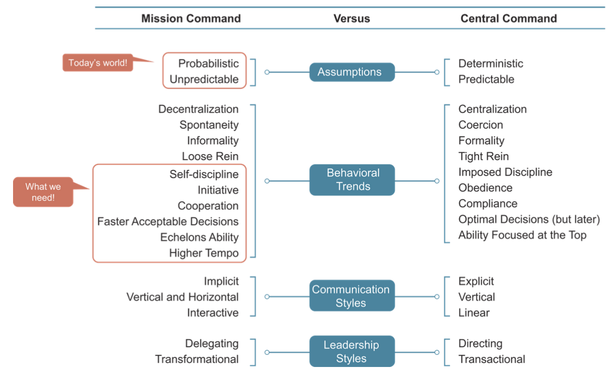
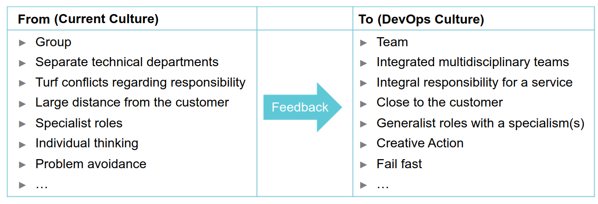

# Module 4 - Getting Acquainted with DevOps Culture and Behavior

## Objectives

* Describe the DevOps culture.
* Explain the core elements of a DevOps Culture.
* Identify the important aspects to implement a DevOps culture.
* How will you identify whether an organization needs a DevOps environment?
* How it can successfully implement an effective DevOps culture?


---

## Topic 1 - Embracing a DevOps Culture

### **What people say about Culture/Organizational Culture**

* _Culture is how organizations 'do things'._
* _Organizational culture defines a jointly shared description of an organization from within._
* _Organizational culture is civilization in the workplace._

> https://hbr.org/2013/05/what-is-organizational-culture


### **Organizational Culture**

Organizational Culture involves the values and behaviors of a particular set of people, contributing to the unique social and psychological environment of an organization. Culture is the sum of behavior and mindset of an organization, supported and enhanced by the values and beliefs of that organization.

Organizational Culture make us:

* Committed to values, purpose, mindsets, and behaviors.
* Motivated in an architecture of organizational practices and behaviors.
* Evident in rituals, stories, and day-to-day practice.
* Transparent with team, customers, and other stakeholders.

The organizational culture influences the way people interact, the context within which knowledge is created, the resistance they will have towards certain changes, and ultimately the way they share knowledge.

Organizational Culture consists of the norms, values, and rules of conduct of an organization as well as management styles, priorities, beliefs, and interpersonal behaviors. Together they create a climate that influences how well people communicate, plan, and make decisions.

DevOps Culture emphasizes small, multidisciplinary teams, who work autonomously and take collective accountability for how actual users experience their software. For a DevOps team, there's no place like production. Everything they do is about making customers' live experience better.

The primary characteristic of DevOps culture is to increase the collaboration between the roles of development and operations teams. There are some important cultural shifts within teams and at an organizational level, that support this collaboration. An attitude of shared responsibility is an aspect of DevOps culture that encourages closer collaboration.

DevOps is positioned around collaboration, which is both encouraged and harnessed by culture. Communication is the fundamental crux which DevOps is founded with the focus on the flow of information. Such information sharing acts as a key to a shared understanding and the association of previously disparate IT silos.


### **Core of DevOps Culture**

The core of DevOps culture is a service mindset that ensures a high-quality product meets the needs of the customer. Therefore, a DevOps team must get regular updates on how their product is being used, analyze the product throughout its lifecycle, and make the necessary modifications to maintain their product's effectiveness.

A DevOps team is responsible for the overall health of the product or service. It does it by practicing some habits, such as:

* Fulfills the needs of the business process it supports.
* Works as intended without problems.
* Does not develop problems as a result of its further growth and development throughout the product's lifecycle.


### **Typical Cultural Aspects of a DevOps Team**

* **Continuous Learning & Continuous Improvement:** the desire to explore and learn should be there in teams. Working together with transparency and knowledge-sharing is necessary.

* **Experimentation & Risk Taking:** always conduct experiments using solid methodologies to capture highly accurate data.

* **Build Quality in:** always show full transparency in teams for the work the team is doing as it ensures building quality products.

* **An Engineering Culture:** utilize knowledge, skills, and creativity to solve problems, implement product features, and optimize the delivery process.

* **A Culture of Effectiveness:** measure effectiveness, culture, and efficiency to optimize DevOps transformation.

* **A Culture of Product Thinking:** ensure that applications must deliver value on their execution in production.

* **A Culture of Taking Responsibility:** every member of the DevOps team should be responsible for the complete product lifecycle.

* **Inspirational and Fun Environment:** an environment in which people perform at best, where they feel inspired, where they want to be, feel welcomed and are encouraged to think out of the box.


### **Growing a Culture**

A culture change cannot be achieved through a top-down mandate. A culture is grow. It lives in the collective hearts and habits of people and their shared perception of "how things are done around here". Someone with authority can demand compliance, but they cannot command optimism, trust, conviction, or creativity.

Culture is like the wind. It is invisible, yet its effect can be seen and felt. When it is blowing in your direction, it results in smooth sailing. When it is blowing against you, everything is more difficult.

For organizations seeking to become more adaptative and innovative, culture change is often the most challenging part of the transformation. Innovation demands new behaviors from leaders and employees that are often antithetical (oposite) to corporate cultures, historically focused on operational excellence and efficiency.


### **What context to provide to facilitate growth areas for teams?**

Culture is about exhibiting specific practices or behaviors in the context to operate.

Some tips to practice the behaviors:


**Continuous Learning and Continuous Improvement**

* Organize by teams.
* Facilitate knowledge sessions.
* Conduct hackathons.
* Make people responsible.
* Use concepts of MVP.
* Set a clear DoD.
* Coach teams with the Agile way of working.


**Experimentation and Risk-Taking**

* Provide time.
* Use instant sandbox environment.
* Remove hurdles.
* Applaud ideas.
* Fail safety.
* Award failure.


**Build Quality in**

* Advocate end-to-end responsibility.
* Encourage the team to utilize their skills as they know the best.
* Avoid cutting corners.
* Practice automation (test, deploy and provision).
* Continuous improvement.
* Transparency (monitors).


**An Engineering Culture**

* Hire people with matching ambitions.
* Move away from the function-title model.
* Support experimentation.
* Support automating manual tasks.
* Do not focus only on utilization.


**A Culture of Effectiveness**

* Begin with the end in mind.
* In retrospectives: ask people why?
* People are responsible for choosing activities in teams.
* Avoid or eliminate handover moments.
* Move away from rigid processes.
* Achieve results in small batches, and generate awareness by Lean.


**A Culture of Product Thinking**

* Encourage customers to attend demos.
* Implement user feedback into a storyboard.
* Allow customers to write about the product and respond.
* Organize people around the product.
* Encourage the team to write blogs about the product (you build it; you run it).


**A Culture of Taking Responsibility**

* Do not explain 'how' to do, ask 'what' is required.
* Address derailment openly.
* Let people figure out how to do things.
* Reward responsibility.
* Reward failure.
* Bring transparency in what everyone is doing.


**Inspirational and Fun Environment**

* Provide good coffee.
* Create nice and open environments.
* Invest in additional facilities like games.
* Conduct contests.
* Arrange drinks at the end of the week.
* Allow teams to modify or tailor the office to their needs.


### **Ron Westrum Typologies of Organizational Culture**

Transforming the culture is about making it more measurable, for example, by relating it to the ability to process information within an organization. Culture is one of the primary considerations for measuring job satisfaction.

> "...job satisfaction is the biggest predictor of profitability, market share, and productivity. The biggest predictor of job satisfaction, in turn, is how effectively organizations process information..." By Ron Westrum

The Ron Westrum model provides the key message of changing the culture of an organization. The model consist of three typologies:


**Pathological** organizations consists of vast amounts of fear and threat. The people of such organizations often keep a lot of information with them for political reasons or prove themselves more desirable or popular.

* Low cooperation.
* Messengers shot.
* Responsibilities shirked.
* Bridging discouraged.
* Failure leads to scapegoating.
* Novelty crushed.


**Bureaucratic** organizations focus on protecting departments. Each department tries hard to become superior and lay down their ground of rules following their book of rules and standards.

* Modest cooperation.
* Messengers neglected.
* Narrow responsibilities.
* Bridging tolerated.
* Failure leads to justice.
* Novelty leads to problems.


**Generative** organizations are mission-focused. They focus only on accomplishing the defined goals and achieving excellent performance.

* High cooperation.
* Messengers trained.
* Risks are shared.
* Bridging encouraged.
* Failure leads to enquiry.
* Novelty implemented.


### **Activity - Identifying the Culture of Your Organization**

How will you describe the culture of your organization, from different perspectives, such as service mindset, high-quality product, continuous support, and overall health of the product?

Create a list.


### **Topic Summary**

Organizational culture involves the values and behaviors of a particular set of people, contributing to the unique social and psychological environment of an organization.

The primary characteristic of DevOps culture is to increase the collaboration between the roles of development and operations teams.

A service mindset ensures that a high-quality product is not just available but also meets the needs of the customer.

For organizations seeking to become more adaptative and innovative, culture change is often the most challenging part of the transformation.

The typical cultural elements of a DevOps team include:

* Continuous Learning & Continuous Improvement.
* Experimentation & Risk Taking.
* Build Quality in.
* An Engineering Culture.
* A Culture of Effectiveness.
* A Culture of Product Thinking.
* A Culture of Taking Responsibility.
* Inspirational and Fun Environment.

The three typologies of Ro Westrum's model (Pathological, Bureaucratic, and Generative) provides the key message of changing the culture of an organization.


---

## Topic 2 - Core Elements of a DevOps Culture


### **What is behavior?**

Behavior is the observable and measurable attributes of people of an organization. It is the way the people of any organization behave.

What factors affect job performance, employee interaction, job commitment, leadership, and managerial styles?

The human behavior of an organization depicts its culture.

The problem is that organizations find it significantly difficult to push people to start exhibiting some expected behavior due to personal habits and resistance.

Organizations can solve this problem by making the process easy for people by defining small and tangible sub-behaviors. Such a subdivision enables teams to progress visibility towards the new behaviors in incremental steps.

Organizational behavior is the study of both group and individual performance and activity within an organization.


### **Behaviors Expected from a DevOps Team**

**Multi-disciplinary**

A DevOps professional do not hesitate to offer help or pick up the tasks of its team member who is too busy or unavailable.


**Transparency**

A DevOps team shares the real-time progress with everyone to be open an honest, for example, by publishing real-time progress reports on the floor monitors.


**Ownership**

The Product Owner of a DevOps team, who is a DevOps professional, keeps all the stakeholders informed about product progress and the required deliverables.

He/she encourages stakeholders to attend demonstrations of the product at every stage to gather feedback.

He/she involves in his/her team members when interacting with stakeholders to enable the team to understand the feedback and the requirements and respond to address the queries raised.


**Prioritization**

The Product Owner and the Team Managers meet at least once per sprint to discuss the work priorities for both functional and non-functional work items.


**Improve Continually**

DevOps professionals work with the mindset of continuous improvement. Hence, a DevOps team does not wait for a critical incident to think of ways of improving its products. They share ideas and opportunities at every release of a product to plan its further improvement.

If a severe incident occurs, they do a blameless postmortem and involve everyone to shares ideas and opportunities for improvement.


**Fail-Safe**

The manager(s) of a DevOps team openly reward the identification, prevention, and resolution of errors. They also inquire about what lesson has everyone learned from these errors.


**Knowledge Sharing**

DevOps professionals personally share their experiences and knowledge amongst their fellow team members. The way helps them to stay updated immediately.


**Empathy**

Everyone in a DevOps team, including the Product Owner, the Scrum Master, or Team Managers, do not hesitate to discuss their concerns openly and ask for required support.


### **Key Beliefs (or Elements) of DevOps**

The true nature of DevOps relates to the way we interact and learn to build secure applications and services. While there is no one way for building DevOps into your organization, you can do this by following a set of core beliefs necessary to achieve a collaborative DevOps culture.


**Team Building and Collaboration**

A DevOps culture is characterized by a high degree of collaboration across roles, focus on business instead of departamental objectives, trust, and a high value placed on learning through experimentation.

Collaboration among cross-functional teams is key to building a successful team. A key to collaboration is open communication with clear transparency of information among people, including senior management.


**Continuous Improvement and Problem-Solving**

Continuous improvement helps teams to think of new ways of working, build better quality products, improve productivity, and reduce costs.


**Courage and Experimentation**

DevOps teams require to leave old ways of working and adopt best practices to optimize the existing processes of the organization. They should have the courage to deliver added value to the customers. The key activity for an effective DevOps team is experimentation and the cultural space to fail.


**Leadership and Feedback**

As a DevOps leader, you need to manage an array of complex systems during a digital transformation. Managing systems is not more complex than the network of humans you sill be working with to get the project done. You need to encourage and facilitate ownership and responsibility for the work.


### **Cultural Element 1 - Team Building and Collaboration**

Teambuilding is a process where individuals with simiar interests and attitudes come together (or collaborate) to work for a common objective.

The primary characteristics are:

* Teamwork.
* Visual Management.
* Collaboration.


#### **Teamwork**

Teamwork is the combined action of people working towards the same end goal. When people talk about teamwork, they mean more than just completing a task, they mean the work that comes from people working together effectively.

People joining a DevOps team often come from different technical teams but have similar skills. However, they do not always have the same purpose or goals. They might be working together with other people (outside their group) to achieve the enterprise's goals. Therefore, when transitioning from a technical team to a DevOps team, it is essential to give proper attention to team-building.


#### **Visual Management**

Visual Management is one of the strongest tools to communicate. In its most basic from, it includes three boards: Day, Week, and Improvement.

Using the three boards, a DevOps team can manage long-term trends, short-term planning, and improvements.

* **Day Board**: is used to manage the daily progress of work.
    * Teams can use a simple (To Do - Doing - Done) or a complicated approach to track the progress.

* **Week Board**: helps ensure the work is planned and agreed upon.
    * Teams should discuss Key Performance Indicators (KPIs) daily, which is impossible. Therefore, they should have such a discussion at least weekly.
    * The board acts as a repository for comments from customers and employees.

* **Improvement Board**: is about gathering all the problems or improvements initiatives to be solved or carried out.
    * Team members should communicate and share solutions and learning.
    * The board shows the progress of problem-solving.


**Kanban** is a key tool of Visual Management that stimulates collaboration to uncover pitfalls.

* A visual board or Kanban board is an Agile project management tool designed to help visualize work, limit work-in-progress, and maximize efficiency (or flow).

* Visual management boards use cards, columns, and continuous improvement to help technology and service teams commit to the right amount of work, and get it done.


The various functions of Visual Management are:

* Transparency.
* Discipline.
* Continuous Improvement.
* Job Facilitation.
* On-the-job Training.
* Shared ownership.
* Management by facts.
* Simplification.
* Unification.


#### **Collaboration**

The most important behavior of teamwork is collaboration.

```
"Successful DevOps requires business, development, QA, and operations organizations to coordinate and play significant roles at different phases of the application lifecycle"

"It may be difficult, even impossible, to eliminate silos, but collaboration is essential."

By Laurie Wurster.
```

DevOps extends far beyond the IT organization. The need for collaboration extends to everyone with a stake int he delivery of software.

Collaboration offers several benefits but also brings with it several pitfalls if not implemented effectively.

| Benefits                          | Pitfalls                                         |
|-----------------------------------|--------------------------------------------------|
| Combines different perspectives   | Irrational decision-making due to group thinking |
| Encourages creativity             | Ambiguity in roles and responsibility            |
| Takes advantage of synergies      | High cost of collaboration                       |
| Brings balance in decision making | Longer decision times                            |
| Improves delivery times           | Conflict within the group                        |


Cooperation is often used as an interchangeable term for Collaboration. It is essential to understand the differences between the two terms.

* **Collaboration**: refers to the action of working with someone to produce or create something. From a business perspective, collaboration can be perceived as practice for individual to work together for achieving a common, shared goal or objective.

* **Cooperation**: is for working with others to achieve your goals, which may be part of a common goal.

Collaboration can be effective with the active and passive participation of all individuals and teams. With just cooperation, we often end up with silos. This may result in the achievement of the individual group goals. However, the organizational goals may not be achieved.

For cooperation to become collaboration, it is important to understand how all of the individuals and teams are successful and what is their value in contributing to the success. This requires that the goals and KPIs of all the individuals and teams are shared and integrated, and not just aligned.

_Food for thought_: think of ways that can encourage people to collaborate and change from individualistic action to team-focused action, especially when considering the possible pitfalls.


### **Activity: Team Activities**

Traditional organizations hire people to perform specific tasks. Therefore, its people are task oriented. However, DevOps teams are involved in other activities and have a more extensive scope of responsibility.

List some of those activities of a DevOps team.

* Define, design, build, validate, release, and evaluate features/patches.
* Define and document hiring profiles or conduct interviews.
* Conduct market research.
* Analyze application usage.
* Analyze production incident.
* Document and share incident postmortems/lessons learned.
* Conduct DevOps Safari: provides a learning platform that enables a team to connect with another team to enhance their knowledge from one another's practices and experiences).
* Improve delivery process effectiveness.
* Research a new technology/tool.
* Refine/align product vision.
* Support customers/application users and answer their questions.


### **Cultural Element 2 - Continuous Improvement and Problem-Solving**

Finding new ways to do things, learning new programming languages or methodologies, and solving problems in new ways is all part of a DevOps culture.

Visual Management serves as a base for continuous improvement and stimulates employee involvement to manage and improve quality.

The willingness to try new things, learn new skills, or implement new technologies is important to maintain the DevOps mindset.

The core elements are:

* Continuos Improvement.
* Structured Problem Solving (or Kaizen Mindset).
* Quality at the Source.


#### **All About Problem-Solving**

```
Engineers build things that solve problems. You don't have to be a computer scientist or have any particular degree to be an engineer. You just have to speak up when things aren't right, evaluate ideas on their merits, and build things that fix what's broken.
```

Continuous Improvement is integral to engineering culture. Developing such a culture within a DevOps team requires them to focus on:

* Facts.
* Data from technical components.
* Use of a service by its customers.

Problem-solving is integrating Kaizen into the behavior and mindset within a team. Kaizen is all about building continuous improvements in the way of working.

It works in two ways:

1. Daily Kaizen, looking for small improvements every day.
2. Kaizen events, handling larger problems using the Kaizen structured problem-solving method of the _Define, Measure, Analyze, Improve, and Control (DMAIC)_ steps.


#### **Structured Problem Solving**

The key tool for continuous improvement is a structured problem-solving method. A well-known method to facilitate continuous improvement is DMAIC.

1. **Defining** a problem includes describing the current situation and why it is not acceptable. Therefore, you should ensure the onboard stakeholders agree with the statement defining the problems. You cannot solve a problem unless you first define it.

2. When the problem is defined, you should **Measure** the additional data to quantify the problem. It is vital to ensure that the data is correct.

3. The next step is to **Analyze** the gathered data. At this point, it is possible to analyze whether the problem is valid or whether it is a random event that does not have a specific cause that can be corrected.

4. If defines potential solutions to the problem. Once some solutions are generated for **Improve**, decide the improvement to implement.

5. After ensuring whether a particular solution works, embed the solution into the organization's way in the **Control** phase, and share any lessons learned.

Another problem-solving method is _Plan-Do-Check-Act (PDCA)_.


#### **Kaizen Mindset**

Kaizen means improvement. In Kaizen, problems are seen as opportunities to improve. The Kaizen methodology is based on making little changes, monitoring the results, and readjusting.

The Kaizen mindset means integrating the three behaviors into the DevOps team:

* Seeing and prioritizing problems.
    * Identify problems.
    * Accept these as part of daily life.

* Solving problems.
    * Understand the root causes of problems.
    * Resolve the problems completely.

* Sharing lessons learned.
    * Share the lessons learned with others, so that they can benefit from it.


#### **Traditional Approach and No Quality at the Source**

Products that traditional organizations develop lack quality at the source and leads to making customers unhappy.

Traditional organizations follow a time-consuming product development process due to the following reasons:

* Lack of automated IT process.
* Absence of an MVP approach.

At the result, the process takes a long time for uncovering problems and identifying solutions after updating the product or service.

* Problems are identified at the time of release, when it is too late.
* Solving problems is difficult and expensive.
* Customers do not like problems (or errors) and want a quick solution that is almost difficult with a traditional development.


#### **Quality at the Source**

The DevOps way of working enables people to:

* Understand the need and benefits of working under architecture.
* Ensure accurate versioning of the product (or software).
* Develop a more secure code due to the early detection of problems or errors.

DevOps team strives for high quality and performance and works with the service mindset.


### **Cultural Element 3 - Courage and Experimentation**

DevOps team dare to experiment, with the potential of failure. They know how to fail fast, take the next step, or go back a couple of steps under time pressure to ensure there is quality at the source.

The core elements are:

* Courage to Act.
* Experimentation.
* Experimentation Meetups.


#### **Courage to Act: a key behavior of a DevOps team**

To ensure that experimentation is embedded in the culture and the way of working, a DevOps team needs to take some steps.

1. Ensure customer buy-in.
2. Define and deliver an MVP.
3. Focus on delivering customer value the first time right with de desired flow.
4. Take small steps avoiding large experiments.


#### **Courage requires Safety**

Business need innovation, but people cannot innovate in an unsafe environment due to apathy, fear, and complacency.

A safe environment is an environment where everybody is free to speak out their thoughts or ideas, critique, and others without the fear of being fired.

For a team to exhibit courageous behavior, there needs to be a safe environment where people can talk and act without of reprisals. Therefore, the primary role of the organization's leadership is to develop a safe environment, within teams, between teams, and across the hierarchy.

A safe environment can be provided through communication, mission, support, and tools.


#### **Experimentation**

Culture is the ability to act in the face of uncertainly or danger while understanding and minimizing the risks. Courage is to take risk, and the underlying key behavior is experimentation.

A high-performing DevOps team has a culture of experimentation. Successful DevOps teams build what-if innovations in their routines.


#### **Experimentation comes with Complications**

Experimentation is about understanding and analyzing a problem, and determining which solutions will work the best. To experiment with low risk, you should have hypotheses that you want to test.

* Hypotheses are tested in a running business when:
    * Business requirements tend to evolve over time.
    * Gaining consensus on requirements might be difficult.

* Hypotheses are tested in a changing IT environment when:
    * Parts of the IT service are changed or the service itself is changed. The baseline changes thereby create new possibilities or impossibilities.
    * New tools and capabilities of IT make actions that were difficult previously.

A DevOps team gathers its courage from the fact that experimentation should occur in a live business environment with varying requirements. However, these days the IT environment is regularly changing and making it difficult to run longer-term experiments.

Considering the changing requirements, the aim of a DevOps team should be to take calculated risks, fail fast in a small way, and learn which solutions will work the best.


#### **Experimentation Meetups: a key tool of Courage**

A key tool to encourage experimentation are meetings where new actions or initiatives are tested. Experimentation meetings, such as hackathons, are a great way to stimulate creative action.


### **Cultural Element 4 - Leadership and Feedback**

One of the behaviors to make a DevOps team successful is leadership. The key tool that leaders should use and stimulate is feedback.

The core elements are:

* Empowerment.
* (Facilitating) Leadership.
* Feedback.


#### **Leadership in a DevOps Environment**

Leadership is associated with management. It is about making decisions, acting following the goals of the team, and being accountable for the actions taken by the team.

A DevOps team must be encouraged to lead. In DevOps, leadership is to facilitate teams with a focus on the following two aspects:

* **Mission command**: ensures the DevOps team knows its mission and goal, and is free to act to achieve the mission.

* **Empowerment**: ensures the DevOps team in capable and authorized to tak the required decisions.

DevOps team should feel empowered to make appropriate decisions. It requires:

* Individuals to have sufficient knowledge and authority to act on their decision-making.

* Management to act as a facilitator, especially to remove the obstacles impeding the team's progress.


#### **Leadership: Mission Command vs Central Command**



**Central Command**, also know as Detailed Command, is leading through detailed instructions. It can feel like micro-management.

**Mission Command** is leading through vision and empowerment. The idea is to give people the information they need and the authority to tak action.

The DevOps culture relates to the **Mission Command**. The DevOps teams exists in a world that is unpredictable and requires them to accept uncertainty.


#### **Leadership: 5 Barriers of Effective Collaboration**

A DevOps team needs to ensure the team functions and collaborates correctly, removing away the barriers to effective collaboration.

1. **Inattention to results or the lack of focus on goals**: the team is lacking focus on the goals of the team.

2. **Lack of commitment**: the team members do not support each other in committing decisions. 

3. **Avoidance of accountability**: the teams do not take accountability for each other's work.

4. **Fear of conflict**: the team is afraid of discussing the differences of opinion.

5. **Lack of trust**: the team members is like a team of individuals working together.


**Food for thought**: how will you identify and address the five barriers to effective collaboration?


#### **Leadership: Style**

The Lean style of Leadership encourages to see what is happening on the work floor, challenge the way work is done by investigating why activities are carried out the way they are, and always deal with people in a respectful way.

* _Go, See_: senior management must spend time on the plant floor.
* _Ask, Why_: use the "Why?" technique daily.
* _Show, Respect_: respect your people.

Represents how Lean leadership contributes to the development of a DevOps culture.

It is an example of "management by walking around". It means being present on the work floor, asking open questions, and listening carefully while following a respectful approach.


#### **Feedback: a key Leadership Tool**

Feedback is an essential tool for every team member. They should know how to give and receive feedback respectfully.

While **receiving** feedback:

1. Be an active listener.
2. Show appreciation by avoiding the discussion or excuses.
3. Clarify doubts by asking questions.
4. Analyze and then decide what to do with the feedback.

While **giving** feedback:

1. Be specific by describing concrete observations.
2. Wait and listen to clarify questions/reasons.
3. Provide appropriate suggestions.
4. Make it one-on-one.
5. End it on a positive note.

Effective feedback helps develop a culture of experimentation, teambuilding, and improvement.


### **Activity: Leadership and Management**

What kind of leadership and management do you recognize in your organization?

What are the recognizable elements of both in your organization?

_Management focuses on having control, whereas leadership focuses on creating visions and realizing them._


### **Topic Summary**

Behavior is the observable and measurable attributes of people of an organization.

Some of the primary behaviors expected from DevOps professionals include:

* Multidisciplinary.
* Transparency.
* Ownership.
* Prioritization.
* Improve Continually.
* Fail-Safe.
* Knowledge Sharing.
* Empathy.

The core beliefs necessary to achieve a collaborative DevOps culture are:

* Teambuilding and Collaboration.
    * Teamwork.
    * Visual Management.
    * Collaboration.

* Continuous Improvement and Problem-Solving.
    * Continuos Improvement.
    * Structured Problem-Solving / Kaizen Mindset.
    * Quality at the Source.

* Courage and Experimentation.
    * Courage to Act.
    * Experimentation.
    * Experimentation Meetups.

* Leadership and Feedback.
    * Empowerment.
    * (Facilitating) Leadership.
    * Feedback


---

## Topic 3 - Implementation of a DevOps Culture

### **Building a DevOps Culture**

There is no specific order or set of rules that you can follow to build a DevOps culture. Creating a DevOps culture is a step-by-step improvement of the four elements:

1. Teambuilding.
2. Courage.
3. Leadership.
4. Continuous Improvement.

The primary success factor behind the DevOps culture is a **Shared Responsibility**. It is not the job of only one team or team member. It is everyone's job that requires a shift toward transparency, communication, and collaboration across development, IT/Ops, and the business.


### **Changing the Culture: a Collective Movement**

Changing the culture is a collective movement that requires adjusting people's behavior, attitude, and mindset through feedback. Feedback enables individuals and the team to move the current status to the desired situation.



The cultural development of a team (or organization) starts with the end in mind. A DevOps team needs to describe the _To_ situation, which is the DevOps culture.

It is an opportunity for the team to work on giving feedback and understanding and solving the fundamental problems.


### **Topic Summary**

Creating a DevOps culture is a step-by-step improvement of the four elements:

1. Teambuilding.
2. Courage.
3. Continuous Improvement.
4. Leadership.

The cultural development of a team (or organization) starts with the end in mind.

---

## Case Study - Easy Journey Airways - Exercise 3

Develop a DMAIC model with the required descriptions considering the following questions:

1. What would EJ Airways need to do to change their culture towards DevOps?
2. What would you advise them to start with considering the growth areas?
3. What would you suggest to facilitate the growth areas?
4. What will most likely be the hardest hurdle to overcome?


Consider performing the following tasks:

1. List the facilitation tips that are easiest to implement.
2. List the facilitation tips that will be most effective.
3. List the facilitation tips that will remove the most bottleneck.
4. Identify the implementation order of the facilitation tips.
5. Check if any growth area is missing. If yes, why?
6. List the possible hurdles.
7. Write down the proposal that you will submit to management.


---

## Module Summary

In this module, I have learned:

* ...
* ...
* ...

