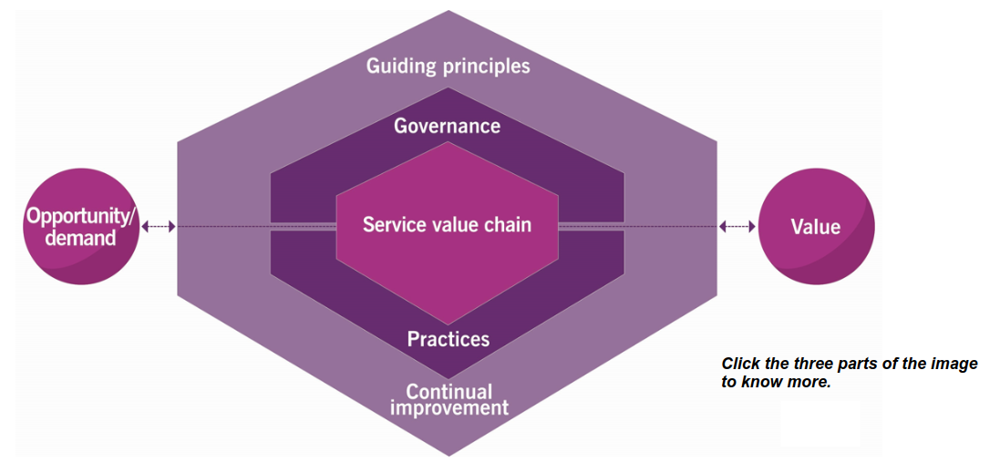

# Module 6 - Getting Familiar with DevOps Management Practices

## Objectives

* Explain the basic concepts of ITSM and its relation to DevOps.
* Identify the various types of wastes involved in product development.
* Suggest the Lean ways at a high-level to improve the flow fo work.
* Describe the importance of the concept of Lean Startup.
* Differentiate traditional product development from Agile development.
* Discuss the various values and principles of the Agile Manifesto.
* Explain the Scrum approach to developing products.

---

## Topic 1 - ITSM - IT Service Management

ITIL v4 provides organizations with a comprehensive framework for IT Service Management (ITSM) that supports the DevOps way of working.

It is designed to ensure that an effective, efficient, flexible, coordinated, and integrated system for governance and management of IT services is established and continually improving in the organization.

The purpose of ITIL is to provide organizations with comprehensive guidance for the management of IT-enabled service in the digital economy.

ITIL also provides a holistic end-to-end approach that integrates frameworks such as Lean, Agile and DevOps.

ITSM talks about services. Understanding how a product is different from a service is, therefore, essential before moving on to the ITSM concepts.

### **Product vs Services**

Product, according to ITIL v4, is a configuration of resources, created by the organization that will be potentially valuable for their customers. It is an offering that organizations sell to their customers.

Service is a means of enabling value co-creation by facilitating outcomes that customers want to achieve without the customer having to manage specific costs and risks. It is an offering that includes intangible elements.

They key differentiators of services include:

* Co-creation of value.
* No transfer of ownership and management of costs and risks to customers.
* Perishable, intangible, and interaction-related nature (at least party).

A product is tangible. You can pick it up, put it in a cabinet, and feel it. A service is often a combination of one or more tangible products and intangible elements. 

### **ITIL v4**

ITIL v4 guides modern organizations, planning to adopt the latest technologies, operational processes, and concepts, in a service context using the key elements.

These elements are the **Service Value System** or SVS, and four **Dimensions**:

* **SVS**: the central element of the SVS is the service value chain. It is an operating model that outlines the key activities required to respond to demand and facilitate value creation through the creation and management of products and services.

* **The 4 Dimensions**: the four dimensions of service management from the Critical Four Pillars to support de SVS, the Service Value Chain, and the Practices.

### **Service Value System**

A key component of the ITIL v4 framework is the ITIL Service Value System (SVS). There are five core components of the SVS, and the service value chain is one of these components.

The SVS supports every type of organization, including High-Velocity IT organizations.

The left side of the figure shows the inputs feeding into the SVS.

The right side show the output created for the organization, its customers, and other stakeholders.

The main inputs to the SVS are opportunity and demand:

* Opportunity refer to options or possibilities that can add value for customers and stakeholders or otherwise help the organization to improve.
* Demand refers to the need for products and services among consumers.

Opportunity and Demand generate activities within the ITIL SVS, which lead to the creation of value.

The value is the output/outcome of the ITIL SVS. The value represents the perceived benefits, usefulness, and importance of something. The ITIL SVS enables the creation of many different types of value for a wide group of stakeholders.

The middle part show the components of the ITIL SVS. These components are:

* **Service Value Chain**: refers to a set of activities performed by an organization to deliver a valuable product or service to its consumers.

* **Guiding Principles**: refer to recommendations that guide organizations in all circumstances, regardless of changes in its goals, strategies, type of work, or management structure.

* **Practices**: refer to a set of organizational resources designed to perform work or accomplish an objective.

* **Continual Improvement**: refers to a recurring activity performed at all levels to ensure that an organization's performance continually meets stakeholders' expectations.

* **Governance**: refers to how (or the means by which) and organization is directed and controlled.

### **Service Value Chain**

The service value chain is an operating model that defines the key activities required to respond to demand and enable value creation through the formation and management of products and services.

The ITIL service value chain includes six value chain activities that lead to the creation of products and services and, in turn, value. The six value chain activities are:

1. **Plan**: ensure a shared understanding of the vision, current status, and improvement direction for all four dimensions and all products and services across the organization.

2. **Improve**: ensures continual improvement of products, services, and practices across all value chain activities and the four dimension of service management.

3. **Engage**: provides a good understanding of stakeholder needs, transparency, continual engagement, and the need for maintaining healthy relationships with all stakeholders.

4. **Design and Transition**: ensures the products and services continually meet stakeholders' expectations for quality, costs, and time-to-market.

5. **Obtain or Build**: ensures the service components are available when and where required, and meet agreed specifications.

6. **Deliver and Support**: assures the services are delivered and supported according to agreed specifications and stakeholders' expectations.

### **Service Value Chain**

The value chain activities represent the steps an organization takes to create value. Each activity contributes to the value chain by converting specific inputs into outputs. In this way, activities interact with each other, wherein each activity receives and provides triggers for further actions to be taken.

To convert inputs into outputs, the value chain activities take different combinations of ITIL practices. Each activity may use internal or third-party resources, skills, and competencies from one or more practices.

Example:

The engage value chain activity might draw on a number of practices including supplier management, service desk management, relationship management, and service request management to respond to new demands for products and services, decisions, or information from various stakeholders.

### **Guiding Principles**

The seven ITIL v4 guiding principles are:

1. Focus on value.
2. Start where you are.
3. Progress iteratively with feedback.
4. Collaborate and promote visibility.
5. Think and work holistically.
6. Keep it simple and practical.
7. Optimize and automate.

The seven guiding principles are the most useful element of ITIL v4. Sharing these principles with the individuals of an organization and encouraging them to use these offer two primary benefits. Using these principles during decision-making enables organizations to make effective decisions. Individuals utilizing these principles do a much better job by creating more value for customers, users, and the organizations itself.

**Focus on Value**

Everything that the organization does need to map, directly or indirectly, to value for the stakeholders. The focus on value principle encompasses many perspectives, including the experience of customers and users.

**Start where you are**

Do not start from scratch and build something new without considering what is already available to be leveraged. There is likely to be a great deal in the current services, processes, programs, projects, and people that can be used to create the desired outcome. The current state should be investigated and observed directly to ensure it is fully understood.

**Progress iteratively with feedback**

Do not attempt to do everything at once. Even huge initiatives must be accomplished iteratively. By organizing work into smaller, manageable sections that can be executed and completed in a timely manner, it is easier to maintain a sharper focus on each effort. Using feedback before, throughout, and after each iteration ensures the actions are focused and appropriate, even if circumstances change.

**Collaborate and promote visibility**

Working together across boundaries produces results that have greater buy-in, more relevance to objectives, and a better likelihood of long-term success. Achieving objectives requires information, understanding, and trust. Work and consequences should be made visible, hidden agendas should be avoided, and information should be shared to the greatest degree possible.

**Think and work holistically**

No service, or element used to provide a service, stands alone. The outcomes achieved by the services provider and service consumer will suffer unless the organization works on the service as a whole, not just on its parts. Results are delivered to internal and external customers through the effective and efficient management and dynamic integration of information, technology, organization, people, practices, partners, and agreements, which should all be coordinated to provide a defined value.

**Keep it simple and practical**

If a process, service, action, or metric provides no value, or produces no useful outcome, eliminate it. In a process or procedure, use the minimum number of steps necessary to accomplish the objectives. Always use outcome-based thinking to produce practical solutions that deliver results.

**Optimize and automate**

Resources of all types, particularly human resources or HR, should be used to their best effect. Eliminate anything that is truly wasteful and use technology to achieve whatever is possible. Human intervention should only happen where it contributes values.

### **Practices**

In ITIL, a management practice is a set of organizational resources designed for performing work or accomplishing an objective.

A DevOps team needs ITSM best practices to meet the goal of deploying changes faster and without disruption. The integration or implementation of ITIL v4 practices in DevOps helps identify, reduce, and eliminate risks and challenges. These practices are utilized during Service Value Chain activities to support and realize different value streams.

ITIL v4 includes 34 practices. Out of these 34 practices, 14 are General Management practices, 15 are Service Management practices, and 3 are Technical Management practices.

#### **Adopting ITIL Practices in DevOps**

ITIL practices are important in a DevOps organization but require special attention.

The implementation of the practices might differ from how the implementation is done in siloed structured organizations.

Some of the reasons why applications of ITIL practices require attention in DevOps are:

* **People are aware that processes may obstruct the ability to adapt to change:** people are aware that they need to adapt to a continuously changing environment. Rigid process descriptions can get in the way of dealing with change.

* **Resources are organized differently:** resources are organized as product teams, resulting in fewer handovers, less complex process descriptions, and minimal documentation.

* **Processes are automated as much as possible:** processes has low variability and are an excellent candidate to automate. Therefore, the major focus is on automating processes to make these faster, more reliable, and repeatable.

* **Teams are end-to-end responsible for the design, implementation, and execution of the product:** the product-centric approach entails the complete responsibility of the product with the team.

* **All teams come together to define the strategy:** often, it is the Product Owners and lead engineers from different teams who work to define the strategy. Topics related to Service Strategy are where all product teams connect through the use of Product Vision boards.

* **Design & Transition, Support, Build/Obtain, and Quality are included within the same team to minimize waste:** it helps avoid a lot of handover moments and waiting times. With very short communication lines and quick handover moments the amount of waste is reduced significantly, which in turn optimizes the whole lead time to production.

* **Product teams work as autonomously as possible:** the teams are free to do any tasks or activities required to deliver the product without alignment and approvals of other teams.

### **Continual Improvement**

The goal of any organization is to create value for its customers, stakeholders, and partners. To achieve this goal, every organization takes part in _Continual Improvement_. To support continual improvement at all levels, the ITIL SVS includes:

**The ITIL Continual Improvement Model**

Provides a structured approach to implement improvements through its seven steps. The scope and details of each step of the model vay significantly based on the subject and the type of improvement.

However, this model should be recognized as a workflow to be used as high-level reminder of a sound thought process to ensure the improvements are properly managed.

The flow seeks to ensure the improvements are linked to the organization's goals and properly prioritized. It also ensures improvement actions produce sustainable results.

**The Improve Service Value Chain Activity**

The purpose of this value chain activity is to ensure continual improvement of products, services, and practices across all Value Chain Activities and the four dimensions fo Service Management.

To better understand the purpose or what is done in the activity, it is important to know the following outputs that are produced as the result of this activity:

* Improvement initiatives and plans TO all.
* Improvement status reports TO all value chain activities.
* Value chain performance information TO the Plan activity and the governing body.
* Contract and agreement requirements TO the Engage activity.
* Service performance information TO the Design and Transition activity.

**The Continual Improvement Practice**

The purpose of the continual improvement practice is to align the organization's practices and services with changing business needs through the ongoing identification and improvement of services, service components, practices, or any element involved in the efficient and effective management of products and services.

### **Governance**

Governance is the means by which an organization is directed and controlled.

Governance is the practice of the governing body to make effective decisions to successfully direct the company.

Governance includes the establishment of policies and the continual monitoring of their proper implementation by the **governing body**.

Organizational governance includes evaluation, direction, and monitoring of the various activities, including service management, that are performed in an organization.

The Governance part is usually done at the strategic level and provides clear direction based on the evaluation of the stakeholder's needs. Management, on the other hand, Plans, Builds, Runs, and Monitors the progress and realization of the direction given by the board of directors.

### **Four Dimensions**

To support a holistic approach to service management, ITIL defines four dimensions that collectively are important for the effective and efficient facilitation of the value. 

While working on initiatives, organizations often start focusing on only one area, ignoring the others. This may lead to unexpected results, loss of work, and delays. Therefore, organizations should consider all dimensions of service management for the efficient working on the entire SVS.

These four dimensions represents perspectives that are relevant to the whole SVS, including the service value chain and all ITIL practices.

1. **Organizations & People**
  * Roles and responsibilities.
  * Formal organizational structure.
  * Organizational culture.
  * Required staffing and competences.

2. **Information & Technology**
  * Information and knowledge.
  * Technologies required.
  * Relationships between different components of the SVS.

3. **Partners & Suppliers**
  * Relationship with other organizations.
  * Contracts and agreements.
  * Service integration and management.

4. **Value Streams & Processes**
  * Define activities and workflows.
  * Service integration and management.
  * Enable value creation.

The four dimensions do not have sharp boundaries. Therefore, there is a probability of having overlapping dimensions.

> **Example:** If members of the service desk team (organizations and people) are being supplied by the third-party service provider, a special consideration must be given to information security and the application of policies and procedures (information and technology).

You might find these dimensions interacting in unusual ways based on the level of complexity and uncertainty in which an organization operates.

If you fail to address any of the dimensions, it can lead to undeliverable services and unmet expectations concerning quality or efficiency.

### **DevOps in Relation to ITSM Processes and Value Streams**

**Traditional IT Organizations**

* These consists of task-oriented silos, requiring specialized skills.
* The teams need formal processes for managing services, leading to waste.
* The teams require a Process Manager, a Process Owner, and KPIs for managing and (or) aligning the various silos, leading to a lot of overhead, and hence, waste.
* **Challenge**: results in a complex matrix organization involving many handovers and transition moments, leading to a lot of waste.

**Modern Agile or DevOps Organizations**

* These consist of customer-centric, service-oriented teams directly and closely integrated with the customers, requiring business representation skills and End-to-End responsibility.
* The teams are cross-functional and autonomous, fully responsible for the lifecycle of products and services, leading to having Development and Operations in the same team.
* The focus is on optimizing the flow via value streams.
* **Challenge**: scaling up teams is a challenge, as maintaining a standard strategy and governance is difficult.

#### **ITSM in the DevOps World**

The ITIL SVS and Service Value Chain support High-Velocity IT in optimizing speed and quality. These also enable teams to deliver the required outputs to the customer and realize the necessary outcomes.

The ITIL v4 practices are supporting Value Streams that help optimize the flow and reduce the amount of waste.

ITIL v4 practices help optimize value delivery based on the organization's / team's needs by supporting the steps in the value streams.

ITIL also helps in automating the required tasks, collaborating with other teams, and managing an end-to-end service.

### **Activity - ITIL and DevOps**

How does ITIL and DevOps compliment each other and why?

Think about practices like:

* Incident Management.
* Problem Management.
* Change Enablement.

### **Topic Summary**

The purpose of ITIL v4 is to provide organizations with comprehensive guidance for the management of IT-enabled services in the digital economy.

ITIL v4 guides modern organizations in a service context using the two key elements, Service Value System (SVS) and four dimensions.

The ITIL SVS includes the following components:

* Service Value Chain.
* Guiding Principles.
* Practices.
* Continual Improvement.
* Governance.

The central element of the SVS is the service value chain, an operating model that outlines the key activities required to respond to demand and facilitate value creation through the creation and management of products and services.

The four dimensions of service management form the critical four pillars to support the SVS, Service Value Chain, and ITIL Practices.

The four dimensions are:

1. Organizations & People.
2. Information & Technology.
3. Value Streams & Processes.
4. Partners & Suppliers.

---

## Topic 2 - Lean

Value to a customer is an action or a process for which the customer will be willing to pay. The core idea of Lean is to maximize this customer value while minimizing waste. Lean means creating more value for customer with fewer resources.

Lean works on three principles:

* Eliminating wast or **Muda**.
* Eliminating overburden or **Muri**.
* Eliminating lack of balance in workloads or **Mura**.

Lean is a systemic approach to identifying and eliminating waste from a process. The goal of Lean is to include Continuous Improvement in the DNA of organizations. Organizations can accomplish Lean by forming Kaizen project teams that work towards transforming major improvements to quick wins.

### **Lean: Satisfying the Customer by Delivering Value**

There are high chances that about two-third of the work you are doing is of either zero or negative value to the customers. Such work is defined as waste and impacts the costs in three ways:

* Development costs.
* Lost opportunity to do more valuable work.
* Cost of added complexity.

Lean focuses on creating maximum customer value using a process that has zero (or minimum) waste. The waste if of different types that act as obstacles in creating the desired customer value.

The eight types of waste can better remembered as **DOWNTIME**:

* **Defects**: efforts wasted by rework, scrap, and incorrect documentation.

* **Overproduction**: producing more that what is required in the current situation.

* **Waiting**: time wasted in waiting for the required parts, information, instructions and equipment.

* **Non-utilized Talent**: under utilizing people's skills and delegating tasks with inadequate training.

* **Transportation**: unnecessary movements of people, products, and information.

* **Inventory**: storing products (or parts of products), materials, and documentation ahead of requirements.

* **Motion**: unnecessary movements of people.

* **Extra-Processing (Over-processing)**: more work due to higher quality than required.

To implement Lean techniques to maximize customer value, organizations follow a five-step thought process. This thought process is easy to remember, but not always easy to achieve:

1. **Identify Customer Value**: define the customer value considering the customer's needs, deadline, and cost.

2. **Map the Value Stream**: create the process flow to eliminate the waste by identifying all the non-value steps.

3. **Ensure Flow**: ensure the remaining steps will flow smoothy in production without any interruptions, delays, or bottlenecks.

4. **Establish Pull**: deliver products to the customers as and when required using the Just-in-Time approach in production.

5. **Seek Perfection**: start the process again for further enhancements and continue it until a perfect value is created with no waste.

These five steps are known as **Lean Principles**. These principles provide the foundation for building the DevOps Culture.

### **Optimizing a Process Using Value Stream Mapping**

Value Stream Mapping or VSM is a tool to gain insight into the workflow of a process.

It can be used to identify both value-adding activities and non-value-adding activities in a process stream while providing insight for optimizing the process chain.

Value Stream Mapping is a Lean management tool that helps visualize the steps required to take from product creation to delivering it to the end-customer.

These steps are:

1. **Define Customer Objectives and Process Actors:** ensure to start working with one process and define customer objectives. Secondly, with a group of people

2. **Define Activities:** define the activities that need to be done within each process actor.

3. **Define Work in Progress:** describe the number of requirements, objects or activities that are currently in the process between actors.

4. **Identify Rework:** determine the actors where the rework happens and what are the causes of rework.

5. **Assess Activities:** take out some time to assess the activities being done.

6. **Determine Process Cycle Efficiency:** start adding information related to timing, such as process time, wait time, and lead time for determining **Process Cycle Efficiency**.

7. **Determine Value Add for Each Activity:** identify value-add and non-value-add activities for the customer.

### **Improve the Flow of Work**

The ultimate aim of DevOps is to achieve high-performance (delivering more value to customers more quickly and at a higher level of quality) by improving the flow of work throughout the organization. During the process of creating flow, a continuous decision-making process is essential to ensure a focus on value-add activities.

Working in silos (or different departments or teams) leads to a lot of waste due to several non-value-add activities, such as handover and transformation moments, manual processes, and repetitive tasks. On the other hard, working as a Business System team (or a cross-functional team) helps minimize this amount of waste enormously and optimize the overall flow.

There are always some *Necessary Non-Value-Add** or **NNVA** activities that organizations cannot ignore and consider these a small part of the value-add work.

Some of the possible ways that you can use to improve the flow of work to the maximum extent include:

* Visualizing the workflow.
* Limiting work in progress.
* Creating a pull and flow.
* Making process policies explicit.
* Improving collaboratively.

### **Lean Startup**

> "A startup is a human institution designed to create a new product or service under conditions of extreme uncertainty." - _Eric Ries, The Lean Startup_

> "Startup success can be engineered by following the process, which means it can be learned, which means it can be taught" - _Eric Ries_

The **Lean Startup** is a _scientific_ approach to creating and managing startups and getting the desired product to customer's hands faster.

The Lean Startup entrepreneurs can begin their journey of a Lean Startup following the loop of three steps:

1. **Finding**.

Choose the business idea by answering, _"Should this product be built?"_ compared to the traditional methodology of answering, _"Can this product be built?"_.

Knowing the answer is essential to analyze whether the product will have sufficient features to solve customers' problems. They spend money on a product only when it solves their problems.

Therefore, analyzing customers' problems before starting with the development of a product is crucial for its success and the business. After all, the product is going to gain the customers' attention only when they will be actively looking for a solution.

2. **Executing**.

You have the business idea, and it's time to start building the Minimum Viable Product (MVP). An MVP is a version of a product with limited but enough features that allow gathering as maximum information as possible about the potential customers and their feedback on the product. An MVP should not include any feature, process or effort that does not contribute directly to the learning you seek.

The Lean Startup methodology supports Kickstarter Approach for releasing the product. The approach suggest selling the unfinished product to create brand awareness, drive up the product's interest in the market, and raise funds for the Lean Startup.

3. **Validating the business idea**.

Validating the product or the business idea is the most essential step to developing a successful Lean Startup. The step suggests experimenting with the idea in the real world by allowing real customers (early adopters and others) to test the product in the marketplace (or the live environment).

The purpose is gathering the required information for analyzing the viability of the product. Based on this analysis and the business strategy, organizations can continue with the further development on the product (the MVP) and the required modifications as follows:

  * **Mostly Positive Results:** continue building the product basis the original business strategy along with incorporating feedback from testers.
  * **A mix of Positive and Negative Results:** modify the product and (or) the business strategy to meet the customers' requirements to the maximum extent.
  * **Mostly Negative Results:** pivot (completely turn) the product and (or) the business strategy. Organizations might need to completely change the method and work towards meeting the gathered requirements of the customers. The almost negative results can also push a Lean Startup to exit the marketplace.

> http://theleanstartup.com/principles

### **Minimal Viable Product (MVP)**

A Minimal Viable Product (MVP) is a development technique in which a new product is developed with enough features that are sufficient to satisfy early adopters. The final, complete set of features is only designed and developed after considering feedback from the product's initial users.

The purpose of developing an MVP is to:

* Test a product hypothesis with minimal resources.
* Reduce waste.
* Provide the product to early customers as soon as possible.
* Get the base ready for other products.
* Quickly build the base for brand.

Complex systems are quite often built without the upfront verification of whether the system will ever be used. Also, when designing new systems, it is difficult to anticipate how the end-user will use these. 

Predicting usage is undoable if you are not incorporating your customer's feedback. This is where the MVP comes into play. The MVP allows you to launch a product quickly, based on your idea, with a small budget. The approach allows you to collect user's feedback for the primary product and include it in future iterations. With the help of an MVP, one can find the right audience, pull the ideas based on experience, and save time.

1. The MVP cycle starts with having an **'idea'**.
2. This idea is subsequently built, resulting in **'code'**.
3. The code is deployed to production and accessed by the end-user, allowing an organization to measure the end-user behavior.
4. These measurements lead to valuable **'data'** from which the organization can **'learn'**.
5. Such learning helps generate new ideas, and you can continue with the MVP cycle.

### **Activity - Developing a Value Stream**

Create a value stream of something like "Doing the organizational training course" and let customers (here, internal) experience how that goes and what kind of challenges occur.

While creating the organizational training course, you should logically have access to proper materials and links to accredited trainers. So, you can make assumptions wherever necessary.

### **Topic Summary**

The core idea of Lean is to maximize customer value while minimizing waste.

There are high chances that about two-thirds of the work you are doing is of either zero or negative value to our customers. The abbreviation DOWNTIME depicts the eight types of Lean wastes.

The five Lean principles are identifying the customer value, mapping the value stream, ensuring flow, establishing pull, and seeking perfection.

Vale stream mapping is a Lean management tool that helps visualize the steps required to take from product creation to delivering it to the end-customer.

The possible ways to improve the flow of work are visualizing the workflow, limiting work in progress, creating a pull and flow, making process policies explicit, and improving collaboratively.

The Lean Startup is a scientific approach to creating and managing startups and getting the desired product to customers' hands faster following a loop of three steps: Find, Execute, and Validate.

A Minimal Viable Product (MVP) is a development technique in which a new product is developed with enough features that are sufficient to satisfy early adopters.

---

## Topic 3 - Agile

### **Agile: Satisfying the Customer Through Continuous Value Delivery**

Agile is described as an iterative and incremental approach to software development.

Agile breaks the development of new functionalities into smaller functional units according to user stories. The next step is to prioritize these stories to continuously deliver the software in short cycles, known as iterations. It aims to build software incrementally from the start of the project. Agile focuses on smaller funcional units instead of developing the complete software in a go.

DevOps, in many ways, fits uniquely well with Agile. The two unique approaches are almost synonymous except for prevue in scope. The convergence of development methodologies and delivery solutions has paved the way for numerous companies to reap huge success and improvements.

### **Traditional vs Agile Product Development - 1**

Agile refers to a group of software development methodologies based on iterative development, where requirements and solutions evolve through collaboration between self-organizing, cross-functional teams.

#### **Traditional Development**

* It starts with a complete product design.
* Building the product is followed by testing the final product.
* The final product is tested in the live environment.
* It involves no feedback loops.
* It is a systematic way to develop products (Plan-Driven).
* It is focused on activities (Activity-Focused).

#### **Agile Development**

* It is focused on delivering functional product every Sprint.
* It is an iterative way to deliver products starting with the basic functionality and adding features with each iteration (Sprint).
* It is focused on delivering value to the customer early through Continuous Delivery (Value-Drive).
* It is focused on the deliverable, which is the product (Product-Focused).

### **Traditional vs Agile Product Development - 2**

**Plan Driven vs Value Driven**

Management measures the success of any product based on three constraints: time, cost, and scope. Changes in one of the constraints will impact the other two, and hence the overall quality.

The traditional way of developing products follows the traditional approach to project management. According to this approach, the management estimates the schedule and the cost keeping the scope fixed. If there is a change in scope, this approach requires replanning and rebaselining the schedule and the cost.

Agile development is vision-driven and focused on delivering value. Therefore, it estimates the scope, which can deliver value, keeping the schedule and the cost fixed. As a result, the team feels confident by delivering the value based on set standards and without stressing about the schedule or the cost. The Agile approach also helps stakeholders to understand creating value with a clear vision in Sprints (or over a period).

**Food for Thought**:

* What are the criteria that management should consider for product development?
* What do you mean by creating customer value? How does Agile help in creating value?
* What do you think can be the possible benefits of going Agile?

### **Traditional vs Agile Product Development - 3**

**Activity Focused vs Product Focused**

| Aspect            | Activity-Focused                       | Product-Focused                  |
| ----------------- | -------------------------------------- | -------------------------------- |
| Development Style | Traditional way of Product Development | Agile way of Product Development |
| Working Style     | Work with Individuals (in silos)       | Collaborative Work (as one team) |
| People            | Functionally Organized                 | Team Organized                   |
| Team              | Project-Focused                        | Product-Focused                  |
| Responsibility    | Work-oriented Limited Responsibility   | End-to-end Responsibility        |

### **Agile Teams - Multidisciplinary Feature Teams**

Multidisciplinary feature teams have multiple skills and are responsible for a fully working product. The Agile teams are multidisciplinary teams with a variety of skills. Members of such a team can exhibit multiple skills.

In an organization that implements a DevOps culture, the resources usually exhibit multiple skills. Every team member is equally responsible and accountable for a product. Having all skills working as one product-focused team reduces expensive handover moments and optimizes process throughput.

### **12 Principles of the Agile Manifesto**

Organizations, teams, or individuals should consider the 12 principles of the Agile Manifesto when adopting the Agile way of working.

1. Our highest priority is to satisfy the customer through early and continuous delivery of valuable software.
2. Welcome changing requirements, even late in development. Agile processes harness change for the customer's competitive advantage.
3. Deliver working software frequently, from a couple of weeks to a couple of months, with a preference to the shorter timescale.
4. Business people and developers must work together daily throughout the project.
5. Build projects around motivated individuals. Give them the environment and support they need, and trust them to get the job done.
6. The most efficient and effective method of conveying information to and within a development team is face-to-face conversation.
7. Working software is the primary measure of progress.
8. Agile processes promote sustainable development. The sponsors, developers, and users should be able to maintain a constant pace indefinitely.
9. Continuous attention to technical excellence and good design enhances agility.
10. Simplicity (the art of maximizing the amount of work not done) is essential.
11. The best architectures, requirements, and designers emerge from self-organizing teams.
12. At regular intervals, the team reflects on how to become more effective, then tunes and adjusts its behavior accordingly.

### **The Agile Manifesto**

The Agile manifesto focuses on choosing the activity that provides more value in realizing the end product.

* Individuals and interactions over processes and tools.
* Working software over comprehensive documentation.
* Customer collaboration over contract negotiation.
* Responding to change over following a plan.

### **Agile Umbrella of Several Methods and Frameworks**

Agile is not a method in itself. It is an umbrella term for all the methods and methodologies (frameworks) that satisfy the four values and the twelve principles of the Agile Manifesto. Organizations can use any or these methodologies to become Agile.

### **The Scrum Approach**

The Scrum framework specifies that a product is built via a series of sprints, which are fixed-length iterations. Sprints are time-boxed events that are not more than a month-long. Usually, these are for two weeks.

The Scrum framework is a set of roles, artifacts, events, flow, social objects, and improvement cycles.

### **Scrum Roles**

Scrum has three main roles.

**Scrum Team**

The scrum team is a multidisciplinary, self-organizing team. It consists of usually 3 to 9 members, who work together to deliver the requested and committed product in increments. The team itself decides what tasks it can accomplish in one sprint and shares a common goal.

**Scrum Master**

The Scrum Master servers as a Servant Leader. The primary responsibilities of a Scrum Master include ensuring:

* The Scrum process is being followed.
* The team is working according to Scrum rules and behaviors.
* The team is performing the required tasks to develop the end product without any distractions.

**Product Owner**

The Product Owner is a holder of product value and is responsible for maximizing the value of the product. The primary responsibilities of a Product Owner include:

* Identifying the tasks that need to be done and setting the priorities to deliver the highest value to customers.
* Maintaining the product backlog and defining user stories.
* Ensuring the user stories adhere to the Definition of Ready (DoR) in terms of how requirements are described.

### **Scrum Artifacts**

Artifacts provide the key information that the Scrum Team and the stakeholders need to know for understanding the product being developed and the activities related to it.

Scrum has three main artifacts.

**Product Backlog**

Product Backlog is a continuously evolving, ordered list of items to be done in a project. It is a single source of truth for any modifications to be made to the product.

**Sprint Backlog**

Sprint backlog specifies the changes to be carried out in one sprint. It also contains the plan for Development team that specifies how they are going to deliver the product increment at the end of a Sprint.

**Increment - Potentially Shippable Product (Finished Work)**

As per Scrum Inc, "a Potentially Shippable Product is the outcome of the Product Backlog Items delivered at each Sprint. 

Delivery Potentially Shippable Product at each Sprint is essential to the Scrum because when work is divided into simple pieces, it can be finished in a short iterations."

### **Scrum Events**

The flow of the Scrum framework is defined by a sequence of events.

**Sprint Planning**

The Sprint Planning includes the planning for the work to be performed in a sprint. It occurs at the start of each sprint.

Sprint Planning is time-boxed to a maximum of eight hours for a one-month Sprint. For shorter Sprints, the event is usually shorter.

During this session/planning, the Scrum Team determines the amount of work required to fulfill a new activity.

**Sprint**

Ir refers to the heart of the Scrum. During this session, a product increment is developed. In the Sprint event, a potentially releasable product increment is created. It is a time-boxed event of one month or less. A new Sprint starts immediately after the conclusion of the previous Sprint.

**Daily Standup**

The Daily Scrum/Standup is a 15-minute time-boxed event for the Scrum Team. During this meeting, the team specifies what they did the previous day and what they are going to do today. The team also lists the impediments or backlogs that prevent the team from meeting the Sprint goal.

**Sprint Review**

A Sprint Review occurs at the end of the Sprint. In this session, the Scrum Team and stakeholders look at what was done in the Sprint. The attendees of the Sprint Review session also look at the items that need to be done to optimize value in the next Sprint.

**Sprint Retrospective**

The Sprint Retrospective event helps the team to inspect itself and create a plan for improvements. The event occurs after the Sprint Review and before the next Sprint Planning.

It is a time-boxed event of 3 hours for a 1-month Sprint. For shorter Sprints, the event is usually shorter.

**Backlog Refinement**

The Backlog Refinement session helps the Product Owner and the Scrum Team to keep the backlog clean and orderly. The session usually happens when the Sprint is about to end, and the Product Owner tries to improve the user stories.

### **Including the MVP in an Agile Process**

An MVP can improve Agile project management planning by ensuring the teams iterate intelligently. In an Agile process, one needs to ensure the selection of tasks from the product backlog is done in such a way that an MVP is delivered at the end of the Sprint.

### **Some Advantages of Working Agile**

The Agile way of working has many advantages, some of which are hard to quantify. Topics such as team dynamics, customer involvement, and the feeling of product ownership are not easy to measure. However, from a business point of view, some of the topics that can be measured include:

* Visibility.
* Risk.
* Business Value.

From a security perspective, having the ability to deliver a product continuously places a positive impact on security-related topics. For example, defects and vulnerabilities are fixed faster compared to the traditional quarterly release cycle. Building the limited functionality (that will be used by the customers) leads to a minimum risk-surface-area. Moreover, the team will work more coherently towards securing quality aspects of the product due to their focus on product delivery compared to performing activities, which in itself have no meaning.

**Visibility**

As Product Owner and business are involved with product development regularly, for instance by attending the Sprintly demo or by launching new shippable features regularly, visibility of what to be delivered is far higher compared to the traditional development methods. Parts of the product are delivered regularly.

**Risk**

Optimization of product visibility lowers the risk. It becomes clear early in the process whether the team is moving in the right direction and building the right product. It is all about feedback and using this feedback to lower risk.

**Business Value**

By delivering a shippable product at the end of each Sprint, the product can be used to generate business value throughout the product development cycle. Features are prevented to avoid getting "stuck" in the development cycle and are shipped straight away.

The approach contradicts the "traditional way of working", where the product is shipped only near the end of the project, preventing the team from considering the valuable feedback of the end-customer through the software development cycle.

### **Activity - Waterfall vs Agile Management of Projects**

List some projects that are managed using the Waterfall approach and some that are managed by the Agile approach. Provide reasons for the same.

* Projects that have a clear understanding of the end product are done through the waterfall approach. For example: building a hospital.
* Projects that lack a clear understanding of the end product and the business requirements are managed through the Agile approach. For example: developing an App.

### **Topic Summary**

Agile is a product-focused, value-driven, iterative, and incremental approach to developing software.

The Agile teams are multidisciplinary teams with a variety of skills. Members of such a team often exhibit multiple skills.

The Agile manifesto focuses on choosing the activity that provides more value in realizing the end product.

Agile is an umbrella for all the methods and methodologies (frameworks) that satisfy the four values and the twelve principles of the Agile Manifesto.

The Scrum framework specifies that a product is built via a series of sprints, which are fixed-length iterations. Scrum focuses on three primary roles, three artifacts, and six events.

An MVP can improve Agile project management planning by ensuring the teams iterate intelligently.

Some advantages of working Agile are:

* Visibility.
* Risk.
* Business Value.
* Security.

---

## Case Study - Easy Journey Airways - Exercise 5

**Identifying Changes in the Current Processes**

EJ Airways is planning a meeting with all service management process/function owners to discuss necessary changes in the current processes. Prepare the agenda for this meeting.

Keep in mind that these process/function owners participated in a Lean course two years ago, and from that perspective, they have scrutinized their processes.

You need to reuse the results of earlier case-study exercises, such as:

* **Urgency**: consider process-throughput related issues.
  * Module 5 - Exercise 4: Adopting the Product-focused Approach.

* **Reasons for Change:** consider the elevator pitch.
  * Module 2 - Exercise 2: Transforming EJ Airways.

* **Action Plan:** consider the quick wins.
  * Module 4 - Exercise 3: Developing the DMAIC Model.

The processes were scrutinized only two years ago. It makes it necessary to put more emphasis on urgency and to substantiate the reasons for the change. Instead of urgency, the meeting could start with an "inventory of the biggest bottlenecks in your daily work".

---

## Case Study - Easy Journey Airways - Exercise 6

**Adopting the Agile Manifesto**

EJ Airways likes to encourage team members to use the Agile Manifesto as a checklist for themselves and their teams. Which principles are likely to require the most attention?

EJ Airways most likely requires the most attention to the following principles:

* Welcome changing requirements even late in development as EJ Airways is not working Agile.
* Encourage face-to-face conversation as EJ Airways is not working with co-located vendors.
* Provide continuous attention to technical excellence and good design to bring stronger customer focus.

---

## Module Summary

In this module, I have learned:

* ...
* ...
* ...
* ...

