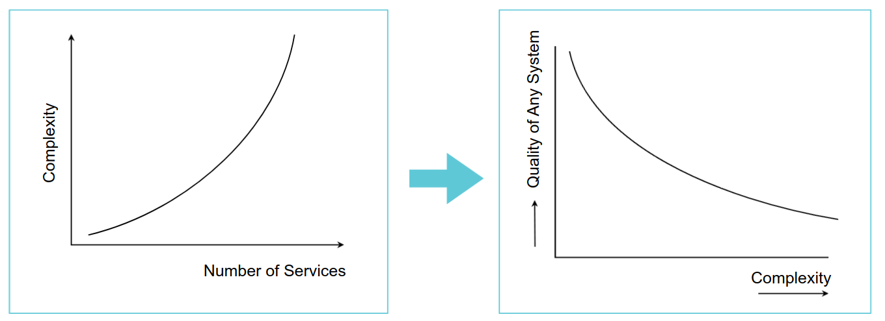
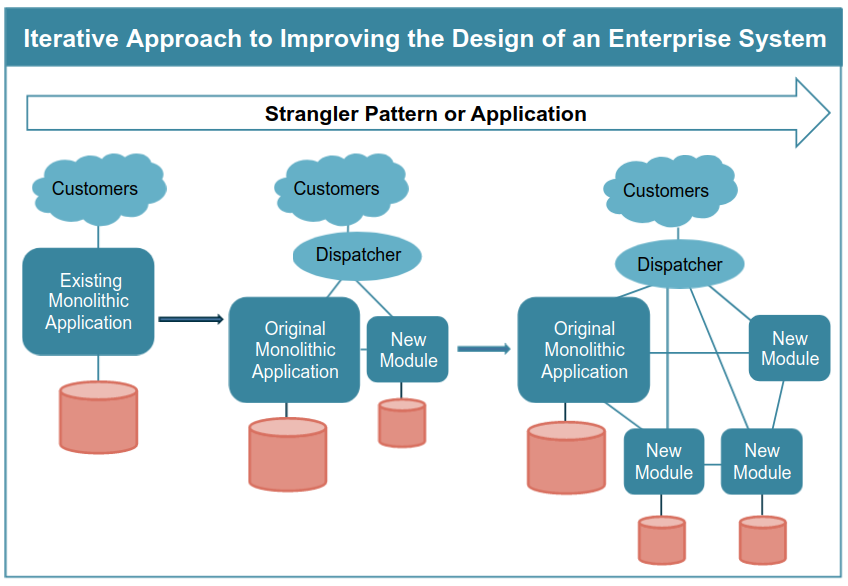
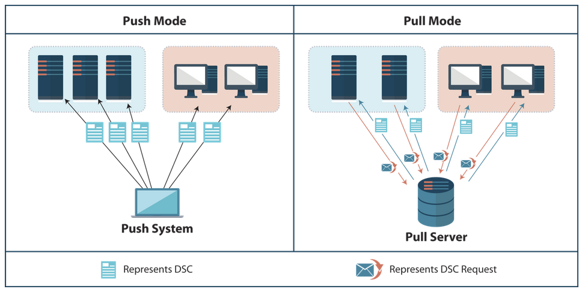
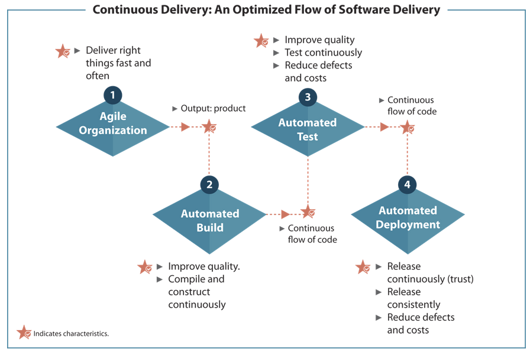
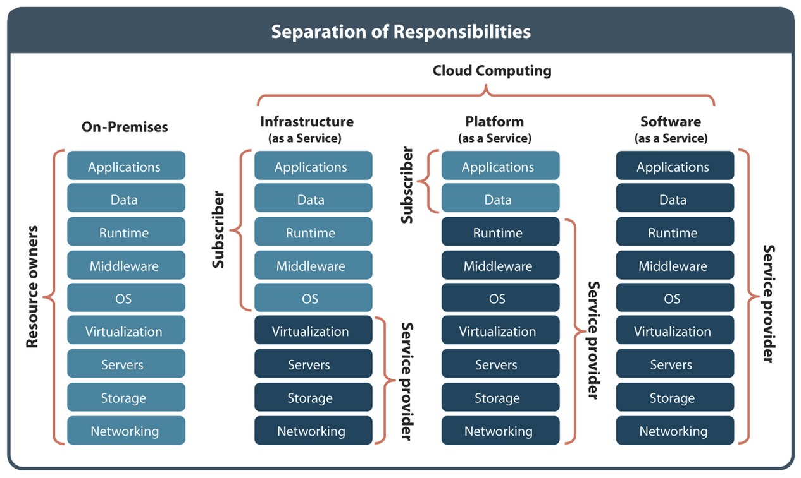
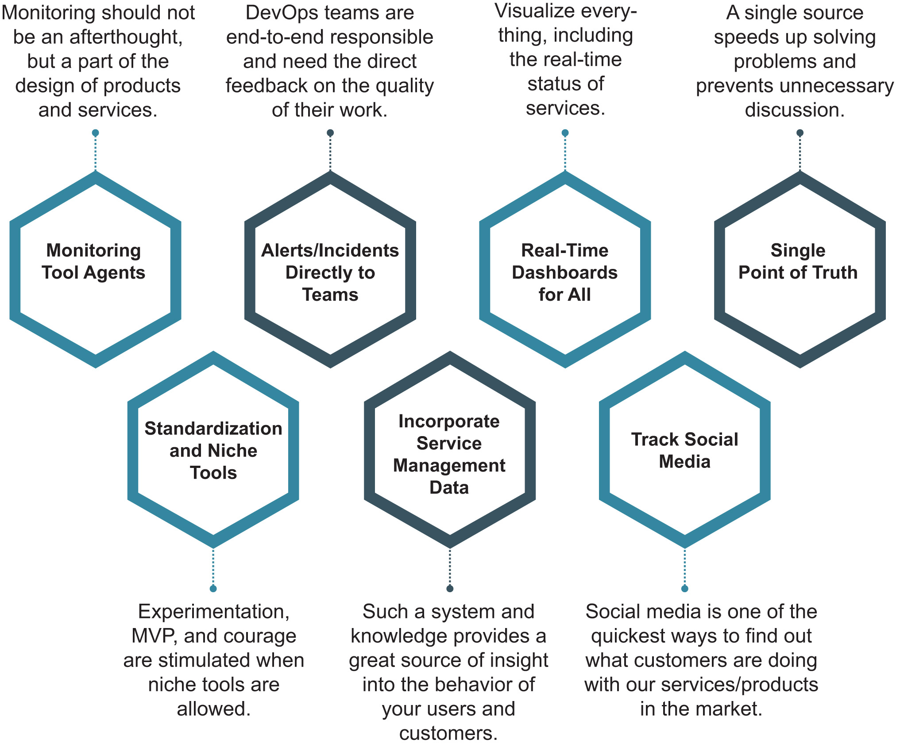

# Module 7 - Getting Familiar with DevOps Technical Practices

## Objectives

* Explain the impact of DevOps on architecture.
* Describe the need for using microservice architecture.
* Explain "How to build systematic resilience?"
* Describe the role of modern infrastructure and cloud in the DevOps world.
* State the relevance of monitoring and logging.

---

## Topic 1 - Architecture

### **Aim of IT Architecture: Functional and Non-Functional Requirements**

IT Architecture aims at functional and non-functional requirements. Together these requirements are know as solution requirements.

IT Architecture aims at delivering value by providing a solution that meets the stakeholders and the business requirements. These requirements consist of functional and non-functional requirements.

Non-functional requirements sound much like those items that should not function. This is not true. These requirements are not deliverable but are indirectly linked to customer value. Therefore, a product should meet these requirements as well.

* **Functional requirements** are the primary requirements stated by the stakeholders. These requirements describe the features and behavior of a product. Functional requirements describe how a product should function to meet the given requirements. These requirements define the tasks a system should do to deliver the required product of service. In simple words, functional requirements describe what a system should to. These requirements can be captured in use cases and can be visually analyzed through drawing and flowcharts.

* **Non-functional requirements** are the secondary requirements that describe the quality characteristics or attributes of a system. Some of these attributes include accessibility, compliance, fault tolerance, autonomy, portability, resiliency, maintainability, testability, scalability, and reliability. If non-functional requirements are ignored, the product or service does not function as expected. In other words, non-functional requirements are the constraints for the system enabling the product or service to function properly. These are dependent on development costs and operational costs. Non-functional requirements are responsible for the overall performance of the product.

For example: sending an email whenever a certain condition is met, such as an order is placed, and a customer signs up is the functional requirement of the system. However, the non-functional requirements for the system can be ensuring the emails are sent with a latency of no greater than 12 hours from such an activity.

### **Role of Non-Functional Requirements in Building Qualities**

Quality can be defined as the sum total of features (functionality) and the inherent characteristics of a product that enable it to meet the given requirements. Therefore, considering non-functional requirements simultaneously with the functional requirements is essential to achieve the required quality.

The traditional approach to developing products or services focuses on functional requirements first. The approach results in delivering a functional (or often unstable) system first. The non-functional requirements are considered late in the development process when the bugs are identified in the system.

In today's era, when the focus is too much on the continuous delivery of customer value, non-functional requirements should be considered from the start of the development process. If this is not done, 'broken' features will be continuously added to the functional end product, breaking the operational system as a whole.

> http://se.ethz.ch/~meyer/publications/computer/quality_first.pdf

> https://blog.seibert-media.com/2018/07/19/quality-functional-and-non-functional-requirements-in-software-development/

### **Building Qualities Through Smaller Services - The Impact**

To achieve quality through Continuous Delivery, organizations focus on delivering smaller services. These services should be independent to carry out a business function, without impacting other business functions. Reducing the size of IT services is not always the solution to decrease the number of issues and increase the quality.

Transforming a complex architecture to architecture with smaller services can be difficult to manage. Due to a large number of smaller services, the architecture can even become more complex. It makes the changes to the application slow as it affects the entire system. Even a smaller modification in the system can lead to redeveloping and redeploying the entire application. Scaling specific functions of an application might lead to scaling the entire application. As a result, the ultimate goal of building qualities will fail.

### **Quality, Complexity, and Number of Services - The Relation**

The number of services is directly proportional to complexity, which in turn is indirectly proportional to quality.

### **Building Qualities Through Microservice Architecture - The Benefits**

Microservice Architecture or MSA or microservices is an alternative architectural style to a larger number of smaller services that help reduce complexity. MSA helps build an application as a suite of small services, each running in its own process and is independently deployable.

Microservices are loosely coupled modular components that enable continuous delivery or deployment of large, complex applications faster, better and cheaper. These also enable an organization to evolve its technology stack.

Microservices are reactive. The four primary qualities of reactive systems, according to Reactive Manifesto, are:

* Responsive.
* Resilient.
* Elastic.
* Loosely coupled (message-driven).

> http://simplearchitectures.blogspot.com/2012/09/snowman-architecture-part-one-overview.html

> https://www.reactivemanifesto.org/

> https://smartbear.com/solutions/microservices/

### **Guidelines to Developing Faster, Cheaper, Better Microservices**

There are many common guidelines for MSA, but on a high level, the most important ones are:

* **Autonomous Systems** have the ability to deliver business value, independent of other services. These systems follow the end-to-end principle from data storage to user interface functions.
* **Simplicity** is about having a minimum number of components and interactions. Do not make the mistake of considering simplicity as simpler. It means simple as much as possible.
* **Low Coupling/High Cohesion** means having low coupling between services and high cohesion within services.

> https://medium.com/@WSO2/guidelines-for-designing-microservices-71ee1997776c

### **Characteristics of MSA**

MSA is an approach to developing a single application as a suite of small services, each running in its own process and communicating with lightweight mechanism. An organization should use MSA to avoid the complexity associated with smaller services.

MSA does not have any specific definition but shares some standard characteristics around the organization, business capability, automated deployment, intelligence in the endpoints, and decentralized control of languages and data.

Some of these characteristics are:

* **Componentization via Services:** a component is an independent replaceable, upgradeable, deployable, cloud-ready, and scalable unit of software. Using services as components provides a more explicit component interface.

* **Organized around Business Capabilities:** microservices are divided into services considering the business capability and **Conway's Law**. These services make the teams cross-functional, including the full range of skills necessary for the development, such as user experience, database, and project management.

* **Products, not Projects:** the product mentality helps an organization in connecting its teams and products with business capabilities. The characteristics focuses on a team's end-to-end responsibility for a product throughout its lifecycle. Organizations can do this by encouraging the teams by providing the required freedom by appreciating **"you build, you run it"**.

* **Smart Endpoints and Dumb Pipes:** these are simple interfaces, such as Enterprise Service Bus (ESB), used for building communication structures between different processes. ESB products usually incorporate advanced facilities for message routing, choreography, transformation, and applying business rules.

* **Decentralized Governance:** unlike centralized governance, it does not support the standardization on a single technology platform. However, standardization is not always a perfect solution for each situation. Decentralized governance focuses on using the appropriate tool to get the job done.

* **Decentralized Data Management:** transactions help with consistency but impose temporal coupling. The decentralized management of data means having different conceptual data models between systems. It is a common issue, when integrating data across a large enterprise, for example, the sales view of a customer can differ from the support view.

* **Infrastructure Automation:** teams that build microservices products or services make extensive use of infrastructure automation techniques, such as Continuous Delivery and Continuous Integration. These techniques help them ensure everything works through automated tests and automated deployments.

* **Design for Failure:** the unavailability of the supplier fails service calls. It requires clients to respond to this unavailability as gracefully as possible, detect the failures quickly, and restore the service (automatically).

* **Evolutionary Design:** the design focuses on creating independent replaceable and upgradeable components. The approach supports rewriting a component, if required, without any impact on its contributors.

> https://martinfowler.com/articles/microservices.html

### **Moving from Legacy to Smaller Services**

Legacy Systems are those systems that use and outdated version of computer systems, programming languages, or application software.

**Problem**: the problem with legacy systems for IT organizations or teams is to effectively modernize software development and operations with the operational legacy infrastructure.

**Reason**: as a result, legacy systems often require high maintenance involving complicated modifications.

**Solution**: The most suitable solution is to draw a line between old and new implementations. All the new implementations can then utilize the much-desired DevOps and Agile methodology.

**What about legacy environments?**

**Problem**: Many organizations prefer to adjust to the existing hard to test or deploy services to avoid rearchitecting the entire design of the enterprise system.

**Reason**: They find it difficult to automate the processes or service developed through legacy systems.

**Solution**: Use evolutionary architecture, you can solve the problem. Evolutionary architecture is an iterative approach to improve the design of the enterprise system.

Evolutionary architecture works with the fact of rearchitecting successful products and services during their lifecycle to meet the varying requirements of customers.

> https://continuousdelivery.com/implementing/architecture/

### **Moving from Legacy to Smaller Services - Strangler Pattern**

Strangler Application or Pattern is an example of evolutionary architecture that uses an iterative approach to improving the design of the enterprise system. Ir replaces the monolithic architecture iteratively with a more componentized one. During the process of iterative replacement, it ensures:

* The new work done is as per principles of Service-Oriented Architecture (SOA).
* The new architecture well delegates to the system, it is replacing.

With time, more and more functionality keeps on adding to the new architecture, replacing the old system being "strangled".

Organization should design a new application with the mindset that it is going to be strangled in the near future. Working with this mindset helps them:

* Prepare for tomorrow's legacy software today only.
* Enable the graceful fading away of today's work.

### **Designing Resilient Systems: Readiness for Unexpected Events**

Resilient systems are designed to be available (or continue its operation), might be with limited or minimum capability, under difficult situations.

Keeping systems highly available and resilient to difficult situations is not rocket science. It is all about preventing errors and automating recovery actions, which require an in-depth analysis of the given system and knowing its boundaries in different areas. 

Such an analysis requires answering several questions. Some of these questions are:

* What are the weak areas across the whole chain?
* Do we have a single point of failure? If yes, what are these?
* What is the impact when it goes down?
* To what extent does the management and provisioning of the automated environments avoid mistakes?
* Is the deployment process fully automated and does it prevent configuration errors?
* Are individual components able to repair themselves or take over tasks in order to contribute to the overall stability?
* To what extent is the testing process automated?

The overall performance of resilient system comes from multiple areas that it should cater to.

> https://whatis.techtarget.com/definition/Simian-Army

> https://netflixtechblog.com/

### **Activity - High-Performing IT Structure**

What are your ideas for moving from a legacy system to a more modern high-performing IT structure?

* Replace the legacy system.
* Interface with the legacy system.
* Continue with the legacy system.

**Replace**

Replacement may not be a likeable option due to the cost involved in writing off the investment in IT or the cost of the alternative.

* **Action:** create a new system that replaces the full functionality of the legacy system. It provides a long term solution to the problems inherent in maintaining a legacy system.
* **Barrier:** it is the most expensive option.

**Interface**

Many organizations have had to expand the capability and usage of their legacy systems, applications, and mainframes. They usually 'bolt-on' or interface with other applications and IT services using intermediaries or middleware.

* **Action:**
  * Creating interfaces to use legacy systems easily.
  * Modularizing parts of the legacy system to replace these with newer technologies or application interfaces.
  * Making it possible to adopt Service-Oriented Architecture (SOA).

* **Barrier:** Interface with legacy systems can be expensive and difficult.

**Continue**

Over the years, many organizations have kept back-end legacy systems and mainframes. Alternatively, they upgrade to enterprise applications, for example, ERP systems that suffer similar issues as legacy applications. Replacing these applications is expensive and difficult.

* **Action:** continuing the status quo and living with the legacy issue and all the other problems. It usually the most accepted approach.
* **Barrier:** the legacy issue and all the problems remains.

### **Topic Summary**

Functional requirements are the primary requirements that describe the features and the behavior of a product. Non-functional requirements describe the quality characteristics/attributes of a system.

To achieve quality through Continuous Delivery, organizations focus on delivering smaller services. However, reducing the size of IT services is not always the solution to decrease the number of issues and increase quality.

The number of services is directly proportional to complexity, which in turn is indirectly proportional to quality.

Microservice Architecture (MSA) is an alternative style to a larger number of smaller services that help reduce complexity. It does not have any specific definition but shares some standard characteristics.

Evolutionary architecture works with the fact of rearchitecting successful products and services, developed through legacy systems, during their lifecycle to meet the varying requirements of customers.

Strangler Application or Pattern is an example of evolutionary architecture that uses an iterative approach to improving the design of the enterprise system.

Resilient systems are designed to be available (or continue its operation), might be with limited or minimum capability, under difficult situations.

---

## Topic 2 - Modern Infrastructure and Cloud

### **Modern Infrastructure: Pets vs. Cattle - The Metaphor to Symbolize Servers**

The pets vs. cattle metaphor is a useful way to think about IT operations. It relates to managing servers. Manual system provisioning has many similarities with keeping pets, and automated provisioning has similarities with managing cattle.

The old way of doing things treats servers like pets. On th other hand, new ways number servers, like cattle in a herd.

> https://subscription.packtpub.com/book/virtualization_and_cloud/9781785882753/1/ch01lvl1sec08/pets-cattle-chickens-and-snowflakes

### **How is managing pets similar to manual provisioning?**

| Pets                                                                                   | Manual Provisioning                                                                                                                  |
| -------------------------------------------------------------------------------------- | ------------------------------------------------------------------------------------------------------------------------------------ |
| Pets are given names, such as Pussy and Tiger                                          | Servers are given distinct names                                                                                                     |
| People raise them with proper care and love                                            | The servers are handled manually, which includes activities such as updating and configuring software                                |
| They are unique                                                                        | Most systems become unique over time as a result of the applied manual software and configuration changes                            |
| When they are unwell, the owners take them to an animal health care for proper nursing | When the server does not perform, its (unique) problems are analyzed and fixed. Everyone notices the unavailability of these servers |

You scale pet servers by making these big.

### **How is managing cattle similar to automated provisioning?**

| Cattle                                                           | Automated Provisioning                                                                                                                                                                                                                                         |
| ---------------------------------------------------------------- | -------------------------------------------------------------------------------------------------------------------------------------------------------------------------------------------------------------------------------------------------------------- |
| Cattle are given numbers, such as A001 and A002                  | Servers are assigned random numbers                                                                                                                                                                                                                            |
| People manage them as livestock                                  | They are managed as a group                                                                                                                                                                                                                                    |
| They are identical                                               | They are standardized. Software and configuration are defined centrally and applied automatically to many systems                                                                                                                                              |
| When they are unwell, the owners replace them with the other one | When there is a problem with any server (or any server fails), human intervention is not required. The servers can automatically route around failures by restarting or simply replacing itself. Therefore, no one notices the unavailability of these servers |

You scale cattle servers by creating more of these.

### **Automate Environments Through Desired State Configuration**

Automating provisioning is about automating the different environments, especially the production environments. Desired State Configuration (DSC) is a useful approach to automating environments.

DSC specifies the desired software and hardware configuration of systems using a declarative model. It uses a simple standard approach to specify "how you want to configure a server or workstation?" that is easy to maintain and understand. You do not need to get into the details of "how the configuration should happen?".

### **Types of Architecture with DSC**

You can have two types of architecture with DSC: pull and push.

#### **Push**

In the push mode, the system that holds the DSC pushes the desired configurations (or triggers the desired state create/update event) to the managed systems/servers to apply the desired state. The administrators are responsible for pushing the desired configurations to the managed systems/servers. So, only one-way communication is possible.

* **Advantages:**
  * Automation of the deployment enables sending the configurations to the compatible machines after a fixed interval, which is by default 15 minutes.
  * The management of numerous machines, connected of not. As soon as the machine is connected to the network, it asks the "Pull Server" for its configuration.

* **Disadvantages:**
  * You need to deploy one more server.

#### **Pull**

In the pull mode, the server that holds the DSC get the request of applying the desired state from each of the managed systems or servers upon their initialization or on set intervals of time. By default, the interval is 15 minutes. If the desired state is available, the Pull server applies the desired state to the requested managed system/server. So the communication is bidirectional.

* **Advantages:**
  * Set up costs. It is not necessary to invest in a new server because the configuration are pushed from your workstation.
  * The simplicity of the architecture because all configurations are stocked on your workstation.
  * It is ideal for testing the functioning of the "Desired State Configuration".

* **Disadvantages:**
  * The complexity required to manage the machines connected can fail the sending of the configuration as laptops are not always connected to the network.

### **Automated Provisioning with Mutable Infrastructure**

In a traditional mutable server infrastructure, servers are continually updated and modified in place. In other words, these servers are mutable; they can be changed after they're created.

Servers in mutable infrastructure can suffer from configuration drift. If this is undocumented, impromtu changes cause servers' configuration to become increasingly divergent from each other and from the reviewed, approved, and originally-deployed configuration.

These increasingly snowflake-like servers are hard to reproduce and replace, making things like scaling and recovering from issues difficult. Even replicating issues to debug them becomes challenging because of the difficult of creating a staging environment that matches the production environment.

The importance or necessity of a server's different configurations becomes unclear after many manual modifications, so updating or changing any of these may have unintended side effects.

Even in the best case, making changes to an existing system isn't guaranteed to work, which means deployments that rely on doing so risk failing or putting the server into an unknown state.

With this in mind, the primary benefits of using an immutable infrastructure are deployment simplicity, reliability, and consistency, all of which ultimately or eliminate many common pain points and failure points.

### **Automated Provisioning with Immutable Infrastructure**

An immutable infrastructure is another infrastructure paradigm in which servers are never modified after they're deployed.

If something needs to be updated, fixed, or modified in any way, new servers built from a common image with the appropriate changes are provisioned to replace the old ones. After they're validated, they're put into use and the old ones are decommissioned.

The concept of immutable infrastructure is to build the infrastructure components to an exact set of specifications. No deviation, no changes. It is what it is. If a change to a specification is required, then a whole new set of infrastructure is provisioned based on the updated requirements, and the previous infrastructure is taken out of services as it is obsolete.

This concept is similar to what is happening in other industries like consumer electronics. It is now very common for mobile phones th have batteries that cannot be replaced, or storage that cannot be upgraded. So instead of upgrading devices in the field, those devices are now immutable and the whole device needs to be replaced. This provides a level of consistency that makes support easier. Regardless of the number of devices in service, you know exactly what the specifications of each device are and can easily replace as-is in the event of a problem.

The primary technology that makes immutable infrastructure possible at any scale is virtualization (both software and hardware) across networking, servers, and storage. Virtualization is at the core of the modern data center, and makes cloud computing possible. Provisioning and retiring physical hardware to accommodate for every change is cost and time prohibitive. That is why mutable infrastructure has been the norm in all but the biggest companies, until very recently when virtualization become commonplace. Containers (ex: Docker) are the newest trend in the immutable infrastructure space, and they are simply another layer of virtualization.

### **Continuous Delivery for Platform Products**

Adopting the Continuous Delivery practice is equally important for Platform teams especially, when they want to have automated provisioning components. It enables Platform teams, like the Business Systems teams, to optimize their delivery process using the Continuous Delivery principles and provides them various features, such as extensive version control, tracking, (automated) tests, and automated rollout of the platform products.

### **What is Cloud technology?**

Cloud technology is the on-demand delivery of computing services over the Internet (the Cloud). With the pay-as-you-go pricing model, the Cloud or computing services enable organizations to operate their business at lower costs.

Some of the computing services include:

* Severs.
* Storage.
* Databases.
* Networking.
* Software.
* Analytics.
* Intelligence.

The ultimate aim of computing (or Cloud) services is to provide fast innovation, flexible resources, and economies at scale.

### **Cloud Service Models**

The three main cloud service models are:

* **Software as a Service (SaaS)**: provides applications to users.
  * The cloud provider runs business applications.
  * Applications are accesible from a browser.
  * User-specific application configuration settings are limited.

* **Platform as a Service (PaaS)**: provides specialized software components and programming tools to developers.
  * The consumer deploys applications on the cloud using programming languages, libraries, services, and tools supported by the provider.
  * The consumer has control only over the deployed applications and application configuration settings.

* **Infrastructure as a Service (IaaS)**: provides computing infrastructure resources as a service to administrators.
  * The consumer can provision processing, storage, networks, and other fundamental computing resources.
  * The consumer controls over operating systems, storage, and deployed applications and has limited control for selecting networking components (for example, host firewalls).

### **Traditional versus Cloud (Shared) Responsibility Model**

The traditional model (on-premises or private) is completed managed by the organization itself.

In IaaS and PaaS, the responsibilities are partially managed by the service provider and the organization.

SaaS is mostly managed by the service provider with limited control to the consumer, such as user preferences and configuration settings.

### **NIST Cloud Characteristics**

NIST describes the five characteristics of cloud computing. These characteristics are:

**1. On-Demand Self-Service**

Allows automated consumer-centric search, selection, and provisioning.

A consumer can unilaterally provision computing capabilities, such as server time and network storage, as needed automatically without requiring human interaction with each service provider.

For example, ATM.

**2. Broad Network Access:**

Allows accesible connectivity to a arrange of devices and networks.

Capabilities are available over the network and accessed through standard mechanisms that promote use by heterogeneous thin or thick client platforms, such as mobile phones, laptops, and PDAs.

For example, and Executive travelling across continents/countries can access latest updates to website and reports which are available on laptops, tablets, desktops, and so on.

**3. Resource Pooling**

Provides shared resources for one of many tenants supporting different demand and supply capacity.

The provider's computing resources are pooled to serve multiple consumers using a multi-tenant model, with different physical and virtual resources dynamically assigned and re-assigned according to consumer demand. There is a sense of location independence in that the customer generally has no control or knowledge over the exact location of the provided resources but may be able to specify location at a higher level of abstraction, such as country, state, or datacentre. Examples of resources include storage, processing, memory, and network bandwidth. For example, car pooling and taxi/cab sharing.

**4. Rapid Elasticity**

Enables automated provisioning and scaling for one or more tenants.

Capabilities can be rapidly and elastically provisioned, in some cases automatically, to quickly scale out and rapidly released to quickly scale in. To the consumer, the capabilities available for provisioning often appear to be unlimited and can be purchased in any quantity at any time.

**5. Measured Service**

Is the metered resource usage with monitoring, reporting, anc charging mechanisms.

Cloud systems automatically control and optimize resource use by leveraging a metering capability at some level of abstraction appropriate to the type of service, (for example, storage, processing, bandwidth, and active user accounts). Resource usage can be monitored, controlled, and reported providing transparency for both the provider and consumer of the utilized service.

### **DevOps Organizations Adopting Cloud**

Some of the implications of adopting Cloud in DevOps organizations are:

* A clear separation of responsibilities and accountability across teams.
* Self-service concepts required for optimized delivery of valuable software to customers (Continuous Delivery).
* Datacenter optimization using extensive automation.
* Standardization and productization of infrastructure components.

In DevOps organizations. Business System teams use Platform products autonomously through self-services. Therefore, DevOps Platform teams can adopt cloud principles for their platform product development. The various characteristics of Cloud help Platform teams in enabling Business System teams to perform their job independently with minimal or negligible interference.

### **Services Requires by DevOps Business System Teams**

Business System teams require various services to exploit the products that enable them to perform an effective root cause analysis. The analysis allows them to identify the activities (such as executing a post mortem for production incident) that are essential to structurally improve the system (incrementally).

Business System teams require platform capabilities or services for the successful execution and delivery of their applications or products.

#### **Services Required for Successful Execution of Applications and Tools**

* Application management self-services, such as backup restore, server restart, and changing log levels.
* Logging self-services (aggregated).
* Monitoring self-services (aggregated).
* Billing services.

#### **Services Required for Successful Delivery of Changes**

* Software source configuration or version management self-services.
* Test automation and reporting self-services.
* Continuous Integration and reporting self-services.
* Application deployment self-services.
* Artifact sharing, validation (among other security), and publication self-services.
* Test data syndication (or replication) self-services (ensure volatile, anonymized production data is available for certain types of tests).
* Release orchestration self-services.

### **DevOps Platform Teams as Cloud Service Providers**

Platform teams in DevOps organizations can best support Business System teams by offering Cloud services. To meet the needs of Business System teams as a Cloud Service Provider, they must ensure that each product supports the two use cases: **Request Products** and **Use Products**.

**Request Products** use cases refer to situations where Business System teams acquire products through automated self-service.

**Use Products** use cases refer to situations where Business System teams use the acquired products.

Suppose Business System teams need a database for their application. The Platform team can create a self-service portal, where the DevOps Business System teams can request a database with a fully automated self-service. Once the database is created (automatically), the Business System teams can use the database for persistent storage of data.

DevOps Business System teams also require support tools to optimize their delivery process based on Continuous Delivery principles. A Platform team can also provide these tools as products. Acquiring these tools (or products) can also be done using a self-service portal and a fully automated delivery of the (tool) product. Once it becomes available to the Business System teams, they can use the delivery tools to optimize their software delivery process. Note that these delivery tool products can be classified as Software as a Service (SaaS) products.

Developing automated self-services requires investing time and money. Someone has to analyze the common tasks and define the new standards for product development. Therefore, the automated nature of the products requires profound standardization. A standardized platform product can be used in many DevOps Business System teams. Such a standardized platform product does not have any application-specific characteristics.

### **Different Types of Cloud to Operate**

Do DevOps organizations need Platform teams in the presence of cloud services products? It all depends on the type of cloud that an organization chooses to leverage.

A **Private Cloud** gives a single Cloud consumer organization exclusive access to and usage of the infrastructure and computational resources.

* In the case of an on-site private cloud, build and manage your cloud end-to-end in-house.
* In the case of an outsourced private cloud, built and manage your cloud by a third-party provider.

The cloud infrastructure is made available to the general public or a large industry group and is owned by an organization selling cloud services. There is no need for Platform teams if you are planning to use only **Public Cloud** services.

Each type of cloud has its own benefits and drawbacks considering the business requirements. Other than the type of cloud, there are other considerations that can be a deciding factor in choosing the type of clouds, such as cost, legal aspects, and unavailability of the required organizational specific services as a public cloud service.

Organizations can also go by using the combined services of the different types fo cloud know as the **Hybrid Cloud**.

Example of Hybrid Cloud: a Platform team can build a platform product for the middleware (PaaS product in-house) and can go with using a Public Cloud service for delivering a virtual machine that includes the operating system (IaaS product offered by a public cloud provider). In the same way, a managed service provider (outsourced Private Cloud) can choose to base their products on Public Cloud services.

### **Activity - Identifying Cloud Services**

* What are the Cloud services that your organization is using?
* What are the characteristics of these services?

Identify the type of service model.

### **Topic Summary**

The pets vs cattle metaphor is a useful way to think about IT operations. It relates to managing servers. Manual system provisioning has many similarities with keeping pets, and automated provisioning has similarities with managing cattle.

DSC specifies the desired software and hardware configuration of system using a declarative model. You can have two types of architecture with DSC, pull and push.

Components of mutable infrastructure, once created, can be changed. On the other hand, components of immutable infrastructure, once deployed, cannot be changed.

Cloud technology is the on-demand delivery of computing services over the Internet (the Cloud). The three main cloud service models are SaaS, PaaS, and IaaS.

The various characteristics of cloud are:

* On-demand self-service.
* Broad network access.
* Resource pooling.
* Rapid elasticity.
* Measured service.

The various characteristics of cloud help Platform teams in enabling Business System teams to perform their job independently with minimal or negligible interference.

---

## Topic 3 - Operations

### **Continuos Monitoring: The Key to Understand What is Going on**

DevOps puts a strong focus on transparency. Every IT organization requires transparency to enable everyone to have a clear understanding of what is going on in the system. Continuous monitoring helps generate transparency. It helps to continuously ensure the health, performance, and reliability of your application and infrastructure as it moves from development to production. Without complete transparency, it would be difficult to apply the "Plan, Do, Check, Act" or PDCA rules of continuous improvement.

With the introduction of continuous delivery, automated testing and deployment, continuous integration, and others, the need for faster, better, and integrated feedback and alerts has been growing. In the absence of quick and integrated feedback from continuous monitoring, it is difficult to identify the type of problems that can occur and eliminate the potential root causes. Integrating this trend with the end-to-end responsibility or product teams explains that the focus on good monitoring is more than just the basic infrastructure level.

Monitoring requirements at various levels should be a part of the service design from the initial stages. During the design phase, the emphasis should be on automation. A good monitoring design enhances the continuous improvement cycle and helps DevOps teams to speed up their ability to resolve issues. Predictive monitoring prevents systems from falling apart. As a result, customer satisfaction will rise and business results will improve.

### **Scope of Monitoring**

* **Monitoring Infrastructure**: it includes the basic level of infrastructure monitoring, such as servers, storage devices, load balancers, and networking.

* **Monitoring Platform**: it includes monitoring the platforms provided and used by the Platform teams (or Business System teams) to run their applications.

* **Monitoring Application**: having a healthy infrastructure and platform is not good enough for an application to function correctly.

* **Monitoring Business**: monitoring should provide feedback to the business at the earliest to take corrective actions.

* **Monitoring the Monitoring**: with the growing emphasis on monitoring, the need to monitor the monitoring infrastructure is growing.

* **Log Aggregation Monitoring**: tooling for log aggregation is capable of using all the data to detect issues that might have gone unnoticed.

### **Monitor Optimized for DevOps**

DevOps organizations and teams can optimize monitoring in several ways, such as:

* Through monitoring tool agents.
* Sending alerts or incidents directly to teams.
* Having a real-time dashboard for all.
* Having a single point of truth.
* Through standardization and niche tools.
* Incorporating service management data.
* Tacking social media.

### **Modern Operations**

The primary concepts of modern operations include ML, Site Reliability Engineering (SRE), and Intelligent Swarming.

#### **Machine Learning**

ML is one of the fields of AI. It produces AI based experience. It enables IT systems to recognize patterns based on existing algorithms and data sets and develop adequate solution concepts. In simple words, ML depicts the ability of IT systems to find solutions to problems independently by recognizing patterns in databases.

The primary aim of ML is to allow the systems to learn automatically without human intervention of assistance and adjust actions accordingly. Enabling these systems to produce solutions independently requires people to perform the following two steps in advance:

* Update the systems with the required algorithms and data.
* Define the analysis rules for the recognizing patterns in the data stock.

These two steps are necessary to perform the following tasks through ML:

* Finding, extracting, and summarizing relevant data.
* Making predictions based on the analysis data.
* Calculating probabilities for specific results.
* Adapting to certain developments autonomously.
* Optimizing processes based on recognized patterns.

The characteristics of ML include chatbots and self-service, recommendation engines, anomaly detection, ticket completion, intelligent routing, predictive analytics, intelligent an contextual search, and smart notifications.

#### **Site Reliability Engineering**

SRE aims at creating scalable and highly reliable software systems by incorporating and applying the aspects of software engineering to infrastructure and operations problems. SRE is "what happens when a software engineer is tasked with what used to be called operations".

An SRE software systems is highly automatic and self-healing. Therefore, a SR Engineer needs to divide their work between operations and development tasks.

* **Operations**: the engineer should spend around 50% of their time doing operations work, such as issues, on-call, and manual intervention.
* **Development**: the engineer should spend the other 50% of their time on development tasks, such as new features, scaling, or automation.

SRE supports the DevOps way of working, and its principles or characteristics are very much similar to DevOps principles, such as:

* Reduce organizational silos.
* Accepts failure as normal.
* Implement gradual changes.
* Leverage tooling and automation.
* Measure everything.

SRE helps in achieving reliability, implementing Service Level Objectives, eliminating toil, and defining error budgets.

#### **Intelligent Swarming**

Intelligent Swarming is a collaborative, Agile framework enabling organizations to align resources to work. It is also known as collaboration on steroids. It involves the following two primary tasks:

* Remove the tiers of support.
* Call the collective expertise of a "swarm" or analysts, wen required.
* Humans are naturally collaborative and find ways to collaborate, despite hierarchies and escalation models.
* Improve relevancy by understanding the customer who raised the issue, the situation, and the responder.

As Intelligent Swarming focuses on people, therefore, its objectives revolve around them only:

* Perform skill assessment and utilization.
* Optimize people's ability to contribute (create value).
* Increase engagement and loyalty for your customers and your employees.
* Improve customer success and realized value through improved problem-solving.

Intelligent Swarming does not follow any linear way of escalation and encourages collaboration to resolve requests. It matches the request to the first person who is most likely to resolve it. The person owns the request until it is resolved.

Some of the primary characteristics of Intelligent Swarming include being cross-functional, having rotating teams swarming to create more value, prioritizing networks over hierarchy and collaboration over escalation. Intelligent Swarming is not limited only to major incidents.

> https://jonstevenshall.medium.com/itsm-devops-and-why-the-three-tier-structure-must-be-replaced-with-swarming-91e76ba22304

> https://sre.google/workbook/table-of-contents/

> https://www.serviceinnovation.org/intelligent-swarming/

### **Logging: Stakeholders and Usage Examples**

Logging is the process of creating and on-going record of application events in the form of log files, also known as logs.

Logs files provide a tracking mechanism to review any event within a system, or the usage of IT services by users and customers, including failures and state transformations.

Logs can be the source of important data for everything from forensics analysis to audit records.

Utilizing log data:

* Helps identify the cause of performance problems.
* Enables DevOps teams to troubleshoot issues by analyzing changes that resulted in error reporting.
* Acts as a compliancy or security tool that helps server the stakeholders' needs,

| Stakeholder | Agenda               | Activities                                                                                             |
| ----------- | -------------------- | ------------------------------------------------------------------------------------------------------ |
| Auditing    | Building Audit Trail | Developing a trail of data for auditors to support them in performing their audits                     |
| Business    | Analysis             | Collecting data for Business Intelligence (BI) analysis to understand customer behavior                |
| Business    | Monitoring           | Identifying anomalies                                                                                  |
| DevOps Team | Monitoring           | Identifying issues, trends, and anomalies                                                              |
| DevOps Team | Troubleshooting      | Analyzing information and error messages to understand what is happening in the Production environment |
| Security    | Tracking Access      | Tracking successful and unsuccessful access attempts and intrusion detection                           |

### **Topic Summary**

With the introduction of continuous delivery, automated testing and deployment, continuous integration, and others, the need for faster, better, and integrated feedback and alerts has been growing.

Scope for monitoring includes:

* Monitoring Infrastructure.
* Monitoring Platform.
* Monitoring Application.
* Monitoring Business.
* Monitoring the monitoring.
* Log Aggregation monitoring.

Monitoring requirements at various levels should be a part of the service design from the initial stages.

The three primary concepts of modern operations are Machine Learning (ML), Site Reliability Engineering (SRE), and Intelligent Swarming.

Logging is the process of creating an on-going record of application events in the form of log files, also known as logs.

---

## Module Summary

In this module, I have learned:

* ...
* ...
* ...

