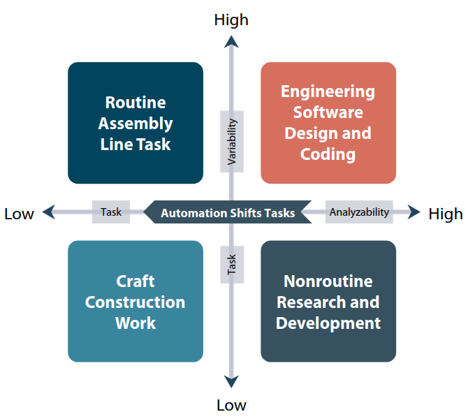
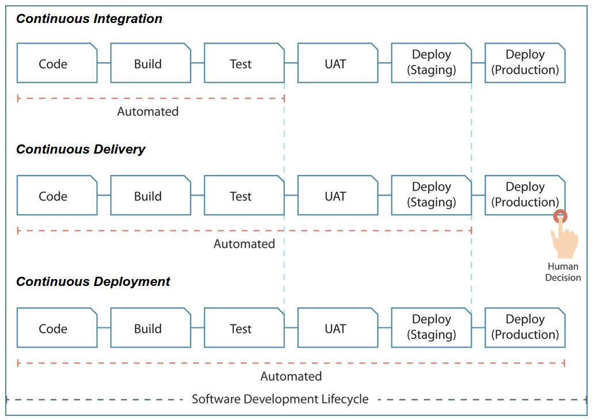
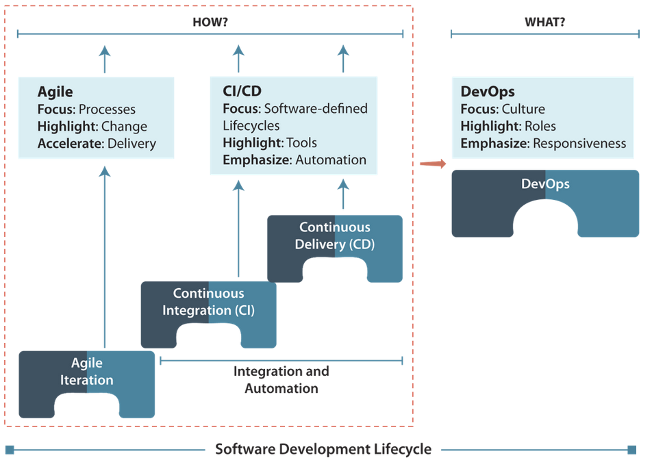
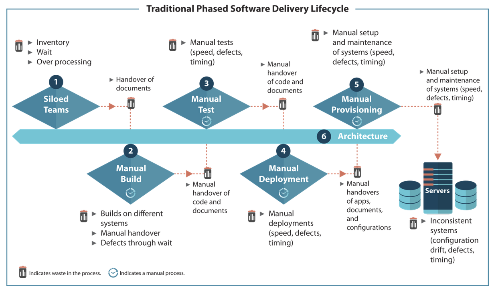
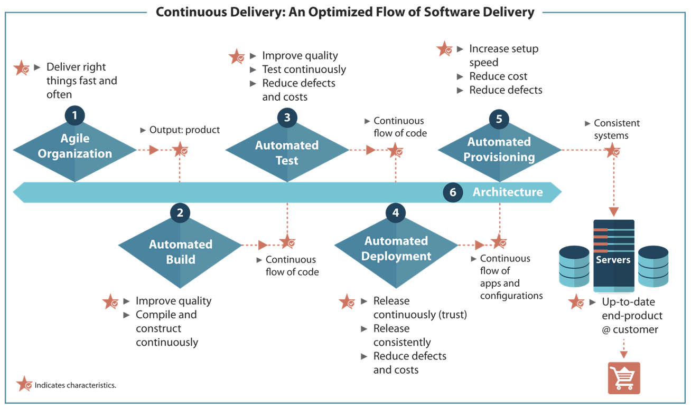
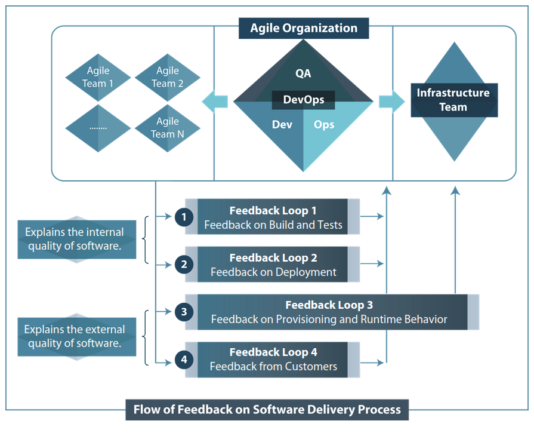

# Module 8 - Enabling DevOps Teams Performance Through Continuous Delivery and Automation

## Objectives

* Describe the impact of automation on software delivery processes.
* Explain the key principles of Continuous Delivery.
* Explain the Continuous Delivery focus topics.
* State the key benefits of Continuous Delivery.

---

## Topic 1 - Software Delivery Automation Concepts

### **Impact of Automation on Routine Jobs**

Routine jobs or repetitive tasks are most likely to get affected due to automation in IT. You can interpret clearly from the graph that the routine jobs, whether cognitive or manual, are not growing due to automation. Once the manual routine tasks are identified, these can be automated with engineering tasks.

Due to concepts of Continuous Delivery and Data Center or Cloud Automation, organizations are in the process of automating routine jobs involved in software delivery, such as installation and deployment activities. Agile and Lean principles play a major role in identifying the routine tasks in any business process.

### **Charles Perrow Topology of Technology**

Charles proposed a framework or model to analyze organizational technology in 1967. He used the variability and analyzability or task as the means of differentiating technologies.

* **Task Variability** refers to the number of exceptions to the standard procedures that are encountered in the application of a given technology. It helps to discover the various ways to perform the given task.

* **Task Analyzability** is a research process to find the most suitable method to deal with Task Variability (or when an exception is encountered).

Placing the two dimensions, Task Variability and Task Analyzability, in a 2x2 matrix yields to four types of technology as listed in the matrix.

* **Craft**: low variability and low analyzability. Yields to unpredictable outcomes. One of the examples of this technology is building construction.

* **Routine**: high variability and low analyzability. Includes traditional manufacturing technologies that use assembly lines. The tasks that organizations outsource are mostly routine tasks.

* **Nonroutine**: low variability and high analyzability. Involves tasks related to strategic planning and research and development. One of the examples of nonroutine technology is space engineering.

* **Engineering**: high variability and high analyzability. Requires in-depth knowledge to perform the required tasks, such as designing and coding software.

### **Automation and DevOps**

Highly programmed and automated processes result in predicted and standardized outputs. Technical complexity is the extent to which a production process can be programmed so that it can be controlled and made predictable.

The repeatable nature of automated processes helps minimize the cost of process execution. Therefore, organizations keep looking for automating processes or tasks as much as possible.

* Organizations identify the routine tasks (High Analyzability and Low Variability) in the existing value stream.
* The routine tasks are automated with engineering tasks (High Analyzability and High Variability).
* Performing engineering tasks requires an organic structure consisting of autonomous, multidisciplinary, self-organized, engineering teams.
* DevOps principles help organizations to successfully implement the organic structure.

Technological advancements are reshaping organizations by automating more and more types of tasks. Some of the tasks that organizations these days prefer to automate to make their business processes highly integrated and streamlined.

The first is automating time-consuming steps: one of the major focus of organizations is to have optimized technical interfaces to provide a simple and easy to use experience to the users.

The first step in this direction is to automate the time-consuming steps of a process. Identifying such steps requires teams to work in an Agile way and apply the Lean concepts to take out unnecessary wast from the current process.

The next task for automation is the deliver process. Organizations focus on automating the delivery process to enable teams to focus more on engineering tasks essential to deliver value to the customers. Ensuring an optimized flow and applying Continuous Delivery practices help organizations to keep on improving the quality of the product by adding new features. Automating the delivery process also helps in reducing the overall costs and turn around times.

Another task for automation is platform standardization. It helps reduce the burden of IT teams and brings compatibility and consistency to the system. Automating platform standardization enables organizations to minimize a lot of changes to the source. Maintaining each variation in the source requires specific procedures that are essential to keep track of changes (variations) to avoid defects.

**Why Standardize your IT infrastructure?**

* **Reduce the burden of IT staff**: your IT department faces a learning curve with each new piece of technology you bring on board. If you're supporting four types of antivirus software in your library, each of those applications uses a different procedure for updating and patching. The troubleshooting and support skills needed for each application are different. The online resources for each piece of software are different.

* **Avoid compatibility problems**: it's difficult to find replacement parts and match the right part with the right computer if you're supporting 15 different models. Also, the more software and hardware you have, the more often you'll encounter conflicts and errors that are hard to isolate and fix.

* **Improve communication**: finally, it's hard for your IT staff to communicate with frontline employees about troubleshooting issues if there's no standard. Neither side really knows what the other party is talking about.

### **Everything as Code: Journey of IT Automation and Standardization**

Everything as code, as the name itself implies, is the concept of having code behind everything, whether it is infrastructure, security, compliance, and operations. So, everything as code is automation only (**Automation**).

The ultimate aim behind this concept is to treat everything as application code and allow these to follow the same or standardized software development lifecycle practices (**Standardization**).

> https://www.hashicorp.com/resources/everything-as-code-the-future-of-ops-tools

### **Topic Summary**

Placing the two dimensions, Task Variability and Task Analyzability, in a 2x2 matrix yields four types of technology: craft, routing, nonroutine, engineering.

Organizations automate routine tasks with engineering tasks, which require an organic structure.

Some of the tasks that organizations these days prefer to automate to make their business processes highly integrated and streamlined include **Time-consuming Steps**, **Delivery Process**, and **Platform Standardization**.

Everything as code is the concept of having code behind everything, whether it is infrastructure, security, compliance, and operations.

---

## Topic 2 - Continuous Delivery Core Concepts

### **Where does Continuous Delivery come from?**

The concept of Continuous Delivery came from the Agile world. It is the most important principle of the Agile Manifesto, which is:

**Agile Principle 1** : our highest priority is to satisfy the customer through early and continuous delivery of valuable software.

### **What is Continuous Delivery?**

Continuous Delivery is a software discipline where you build software in such a way that the software can be released to production at any time.

Continuous Delivery is the ability to get changes of all types (including new features, configuration changes, bug fixes, and experiments) into production, or into the hands of users, safely and quickly in a sustainable way.

Aim: enable businesses to deploy the development version of software or product into production at the touch of a button in a matter of seconds or minutes. It requires deployable software throughout its lifecycle, and push-button deployments.

**Deployable software throughout its lifecycle**: Continuous Delivery requires a ready-to-deploy version of the development software throughout its lifecycle. Therefore, the team working on the existing or new features of the software needs to prioritize their tasks to make it deployment (production) ready 24x7. Gathering fast, automated feedback on the readiness of systems due to any change made to the software becomes quite easy at any point in time.

**Push-button deployments**: push-button deployments enable organizations to meet the business demand for Continuous Delivery. These deployments, as the name implies, allow a business or tis users to initiate the automated deployment of any version (deployment-ready) or the development software to any environment as and when required.

### **Continuous Delivery and Continuous Deployment**

Continuous Delivery is often confused with Continuous Deployment. Continuous Deployment implies Continuous Delivery. However, the converse is not true.

* Continuous Deployment is the practice of releasing every good build to users. A more accurate name can be "continuous release".

* Continuous Delivery means you are able to do frequent deployments. You may choose not to do it due to businesses preferring a slower rate of deployment. To do Continuous Deployment, you must be doing Continuous Delivery.

Continuous Deployment is all about deploying the software in the production environment as and when required 24x7. Companies these days even go for making deployments in minutes or seconds.

Continuous Deployment ensures the changes to the software pass through the Deployment Pipeline before getting these in the production environment. One of the challenges of an automated build and test environment is you want your build to be fast so that you can get fast feedback. However, comprehensive tests take a long time to run. A deployment pipeline is a way to deal with this by breaking up your build into stages. Each stage provides increasing confidence, usually at the cost of extra time. Early stages can find most problems yielding faster feedback, while later stages provide slower and more through probing. Deployment pipelines are a central part of Continuous Delivery.

A preferred way for organizations planning to implement Continuous Delivery should focus on two primary steps:

1. Model the existing delivery process as a deployment pipeline.
2. Analyze the pipeline for bottlenecks, opportunities for automation, and collaboration points.

What do you want at the push of a button? You can ensure this only through the Deployment Pipeline, or you can say automation. Why? The prerequisite for the Deployment Pipeline is automation only. However, it is not at all necessary to automate everything in a go. The preferred way is to start automating some parts of your build, deploy, test, and release processes that might be the bottleneck in the current scenario. You can then continue automating things gradually over time.

### **Continuous Delivery and Continuous Integration**

Continuous Integration is a software development practice where members of a team integrate their work frequently, usually each person integrates at least daily - leading to multiple integrations per day. Each integration is verified by an automated build (including test) to detect integration errors as quickly as possible. Many teams find that this approach leads to significant reduced integration problems and allows a team to develop cohesive software more rapidly.

In other words, Continuous Integration is a process that consist of the two steps or tasks:

1. Integrating (or merging) the code written by developers to a central repository.
2. Validating the integration of code through an automated build or test.

The process includes a server that hosts a Continuous Integration tool. The role of this tool is to keep an eye on the version control tool. Whenever there are changes to the code and a check-in is found, the Continuous Integration tool initiates a trigger for automated compilation, build, and runs unit testing. It also includes some basic level of static code analysis and automated security testing.

So, Continuous Integration usually refers to integrating, building, and testing code within the development environment. Continuous Delivery builds on this, dealing with the final stages required for production deployment.

> https://martinfowler.com/articles/continuousIntegration.html

### **Continuous Integration, Delivery, and Deployment - The Similarities**

The three practices, Continuous Integration, Continuous Delivery, and Continuous Deployment, are related to the software cycle with the same goal of making the software development and release process faster and more robust.

The three practices strongly depends on the comprehensive automation of the build, test, and deployment processes. Such comprehensive automation requires effective collaboration between everyone involved in the process.

It is clear that:

* Continuous Integration is part of both Continuous Delivery and Continuous Deployment.
* Deployments to the production environment in Continuous Delivery are manual (or push-button deployments).
* Continuous Deployment includes automated deployments to production. In other words, the entire software development lifecycle is automated.

Adopting any of the three practices involves significant costs. However, the benefits that these practices provide usually win over the cost involved.

### **Principles of Continuous Delivery**

There are eight principles of Continuous Delivery:

1. Create a repeatable, reliable process for releasing software.
2. Automate almost everything.
3. Keep everything in version control.
4. If it hurts, do it more frequently, and bring the pain forward.
5. Build quality in.
6. Done means released.
7. Everybody is responsible for de deliver process.
8. Continuous Improvement.

### **Fully Automated Continuous Delivery - The Focus Topics**

Automated Continuous Delivery offers several benefits, for example, faster speed to market, faster feedback, lower level of risk, and more productivity. Considering the various business benefits that Continuous Delivery provides, organizations can successfully adopt a fully automated Continuous Delivery process. This requires them to leverage six focus topics:

1. Agile Organization.
2. Automated Build.
3. Automated Test.
4. Automated Deployment.
5. Automated Provisioning.
6. Architecture.

Agile Organization and Architecture are non-automation focus topics and the rest four automation topics.

### **Continuous Delivery and DevOps**

Fully automated Continuous Delivery combines the Continuous Delivery principles and its six focus topics. Such a Continuous Delivery closely relates to DevOps concepts and principles. You can say that the two complement each other. However, the two cannot be considered as a part of each other. DevOps and Continuous Delivery have different origins, and each of these might put more emphasis on certain topics or aspects.

You cannot do DevOps. You can start with Agile development by Continuous Integration (CI) upstream and Continuous Delivery (CD) downstream. Success with CI and CD depends heavily on automation as it helps save time, reduce defects, increase consistency, and enable self-service. By automating CI and CD and encouraging open communication and collaboration, organizations begin to dissolve the gap separating the upstream from the downstream and establish the foundation for a DevOps transformation.

### **Automated Continuous Delivery - The Benefits**

Business aim to win marathons, not just sprints. We know that cutting ahead of the pack takes grit. Consistenly staying ahead of the pack can be even harder. It takes discipline and rigor. Working hard 24x7 will lead to premature burnouts. Instead, work smart, and delegate the repetitive work to machines, which by the way don't need coffee breaks and don't talk back.

Every organization, whether or not a tech company, is using technology to differentiate. Automated pipelines reduce manual labor and lead to eventual savings since personnel is more expensive than tools. The steep upfront investment can cause concern to inexperienced leadership, however, well-designed pipelines position organizations to innovate better and faster to meet their customers' needs.

CD provides the business with more flexibility in how it delivers features and fixes. Specific sets or features can be released to specific customers or released to a subset of customers, to ensure they function and scale as designed. Features can be tested and developed, but left dormant in the product, baking for multiple releases. Does your marketing department want that "big splash" at the yearly industry convention? With continuous delivery, it's not only possible, but it's also a trivial request.

The benefits that automated Continuous Delivery offers wins over this trivial request. Some of these benefits are faster speed to market, faster feedback, lower level or risk, and more productivity.

* **Faster Speed to Market**: to stay in business in the competitive world, organizations aim to provide a feature faster to their customers. Continuous Delivery enables the software delivery team to have a feature ready for production and allows business users to deploy it as and when required.

* **Faster Feedback**: faster speed to market implies faster feedback from the customers. The faster the customers start using the new features, the faster you receive feedback about it. The feedback helps organizations to know about what is working, what is not working, and what the other expectations are. As a result, the software development team will have the requirements for the new feature.

* **Lower Level of Risk**: little human intervention leads to increased productivity. As a result, people can focus more on other important tasks rather than getting stuck with tedious and repetitive tasks. Automation allows the software development team to delegate such tasks to tools.

The various benefits contribute to the primary aim of business, which is sustainability.

### **Activity - Continuous Delivery Principles**

How do the principles listed in the following table relate to the three processes: Continuous Integration, Continuous Delivery, and Continuous Deployment?

| Principle                                                      | C Integration | C Delivery | C Deployment |
| -------------------------------------------------------------- | ------------- | ---------- | ------------ |
| Create a repeatable, reliable process for releasing software   |               |            |              |
| Automate almost everything                                     |               |            |              |
| Keep everything in version control                             |               |            |              |
| If it hurts, do it more frequently, and bring the pain forward |               |            |              |
| Build quality in                                               |               |            |              |
| Done means released                                            |               |            |              |
| Everybody is responsible for the Delivery process              |               |            |              |
| Continuous Improvement                                         |               |            |              |

### **Topic Summary**

Continuous Delivery is a software development discipline where you build software is such a way that the software can be released to production at any time.

Continuous Deployment is the practice of releasing every good build to users. A more accurate name might have been "Continuous Release".

Continuous Integration is a software development practice where members of a team integrate their work frequently, usually each person integrates at least daily, leading to multiple integrations per day.

The eight principles of Continuous Delivery are:

1. Create a repeatable, reliable process for releasing software.
2. Automate almost everything.
3. Keep everything in version control.
4. If it hurts, do it more frequently, and bring the pain forward.
5. Build quality.
6. Done means released.
7. Everybody is responsible for the Delivery process.
8. Continuous Improvement.

The six focus topics of Continuous Delivery are:

1. Agile organization.
2. Automated build.
3. Automated test.
4. Automated deployment
5. Automated provisioning.
6. Architecture.

---

## Topic 3 - Continuous Delivery Automation Concepts

### **Traditional Software Delivery: a Process of Weeks or Months**

In the absence of the Continuous Delivery approach, it is quite common for the software delivery lifecycle to consume weeks or even months. The delay is due to the lack of flow in the process because of the various types of waste.

### **Continuous Delivery: a Process of Minutes**

When DevOps teams work together to automate the various phases of software delivery, such as build, testing, deployment, and provisioning, through a deployment pipeline, it result in an optimized flow.

Automation enables developers to perform the various tasks continuously throughout the delivery process, ensuring quality is built into products and services from the beginning. It also enables developers to remove the various phases of the traditional software delivery lifecycle by incorporating integration and regression testing into their daily work.

The automation tools helps developers to perform regression testing and other tasks within a matter of minutes and push software changes (code) to the production environment in minutes.

### **Continuous Delivery and DevOps Team Performance**

DevOps is about high-performing IT. Therefore, the key area that high-performing DevOps teams focus on is to have and optimized flow in the delivery process. Such a flow keeps enhancing the products by releasing one feature at a time (or a small chunk of code) and getting the early feedback.

Continuos Delivery automation optimizes the software delivery process in such a manner that it enables frequent releases of small chunks of functionality or software features in minutes. Frequent releases ensure getting regular feedback both from the delivery process (that relates to the quality delivered) and the customer (that relates to the product value). Regular feedback enables a team to incorporate the feedback rapidly in their software. It also enables them to become a fast learning team and optimize their output (or performance) by following the principles of failing fast, continuous improvement, and experimentation.

### **Feedback Loops in Software Development**

A feedback loop is essential to reduce risk, improve quality, and ensure a better response to changes. The shorter the loop is, the better the software or product will be.

The intent of having short feedback loops is to save time by removing waste, whether it is through demos, code change, pair programming, continuous delivery, and build and validation cycles. People often do not understand the connection between a change and the result of that change initially, but later they understand its need. Change refers to a change in requirements, development practices, development processes, business plan, code, or design.

The software development and delivery teams receive a lot of feedback from different sources that they can utilize to optimize the current delivery process. The feedback on build, tests, and deployments tells the team about the internal quality of the software. However, the feedback on runtime behavior and feedback from customers explains the external quality.

* **External Quality (Functional)**: external quality is the usefulness of the system as perceived from outside. It provides customer value and meets the product owner's specifications. This quality can be measured through feature tests, QA and customer feedback. This is the quality that affects your clients directly, as opposed to internal quality which affects them indirectly.

* **Internal Quality (Structural)**: internal quality has to do with the way that the system has been constructed. It is a much more granular measurement and considers things like clean code, complexity, duplication, component reuse. This quality can be measured through predefined standards, linting tools, unit tests, etc. Internal quality affects your ability to manage and reason about the program.
  * Is your program able to cope with new requirements easily moving forward?
  * Is your program efficient enough to deal with an inevitable increase in data volume?
  * Is your domain logic decoupled from the framework so that it can be updated without breaking the system?
  * Do you have tests to guard existing functionality?

### **Fail Fast an Often**

Failing fast is a non-intuitive technique that focuses on visible and immediate failure results in early feedback and more transparency, which helps make the software more robust. Bugs are easier to find and fix, so fewer go into production.

Some people recommend making your software robust by working around problems automatically. This result in the software "failing slowly". The program continues working right after and error but fails in strange ways later on. A system that fails fast does exactly the opposite: when a problem occurs, it fails immediately and visibly.

Fail-fast makes bugs and failures appear sooner, thus:

* Bugs it takes fare earlier to detect, easier to reproduce, and faster to fix.
* It's faster to stabilize software.
* Fewer bugs and defects will go into production, thus leading to higher quality and more production-ready software.
* The cost of failures and bugs are reduced.

The longer it takes for a bug to appear on the surface, the longer it takes to fix, and the greater it costs.

Fail-fast is the principle behind many Agile practices, such as:

* **Test-Driven Development (TDD)**: writing tests to cover all the cases in which it would fail, and all the requirements it has to meet, before even implementing it.

* **Continuous Integration**: an Agile practice in software development, where developers are required to integrate their current work into a shared repository/branch several times a day. Each integration is verified by an automated build, thus helping the team to find and fix problems early.

### **Continuous Delivery Automation - Faster, Cheaper, Better**

* **Improved Time to Market*: Continuous Delivery enables teams to make smaller releases to production more often.

* **Limited Set of Changes**: the focus of the team following the Continuous Delivery practice is on smaller releases with a limited set of changes.

* **Reduced Number of Defects**: limited set of changes in production leads to less number of undetected defects.

* **Negligible or No Delays**: checking or troubleshooting the limited code is easy compared to releasing multiple features in a go. Thus, Continuous Delivery helps eliminate delays caused by severe defects.

* **Optimized Team Delivery**: the focus on continuous improvements helps tema to optimize the delivery process, thus enabling them to find the required solution to remove obstacles in the Continuous Delivery focus topics.

The various benefits of automating continuous delivery contribute to faster, cheaper, and better delivery.

**Faster Delivery**

Automated task execution codes not depend on the availability of humans, so the wait time is eliminated. It requires no human-to-machine interaction time and reduces the need for (manual) meta tasks, like a review of an installation document.

**Cheaper Delivery**

Automated task execution is more reliable than manual task execution:

* Manual execution errors are expensive and might not be detected immediately.
* Automated task execution is more repeatable than manual task execution.
* Automated task execution requires no human effort, which is more expensive than machine time.

**Better Delivery**

Automation provides the various capabilities:

* Results in predictable, standardized, reliable, and repeatable outcomes.
* Eliminates manual task execution errors.
* Results in faster feedback loops (test automation) leading to early detection of defects in the process.
* Enables measurement-driven evaluation of the delivered software features.

### **Activity - Software has to flow**

* How does the software products flow in your organization from the development and delivery point of view?
* How optimized is product flow?
* What are the pitfall that you see in the current flow?

Consider the following aspects:

* Is the flow manual or automated?
* How can you optimize the flow?
* Identify different types of waste in the flow.
* Do you follow the Continuous Delivery practice?

### **Topic Summary**

Continuous Delivery means "software has to flow".

The key area that high-performing DevOps teams focus on is to have an optimized flow in the delivery process. Such a flow involves keeps enhancing the products, releasing one feature at a time (or a small chunk of code), and getting the early feedback.

The feedback on build, tests, and deployments tells the Development team about the internal quality of the software. However, the feedback on runtime behavior and feedback from customers explains the external quality of the software.

Some of the benefits of fully automated Continuous Delivery are improved time to market, a limited set of changes, reduced number of defects, negligible delays, and optimized team delivery.

---

## Topic 4 - Continuous Delivery Automation Focus Topics

Focus topics help define and implement Continuous Delivery practices. Organizations that have adopted or are adopting Continuous Delivery practices use a number of frameworks and tools for these topics to successfully implement Continuous Delivery.

The best fit solution for each organization depends on the application and infrastructure technology, DevOps maturity, and the problem or business domain.

### **Activity - Continuous Delivery Focus Topics**

* How does your organization apply Continuous Delivery Focus topics?

The purpose of this activity is to know about the different ways of practicing Continuous Delivery.

### **Topic Summary**

Build automation is the process of automatically transforming the changes in code to a collection of published deployment artifacts (or Deployment Pipeline), which are the deployable components of your application software.

Two of the popular and effective development techniques that involve automated testing are TDD and BDD.

Automated deployment is about automatic application deployments.

Automated deployments through Agile development have the power to minimize the time that it takes from ideation of features to the final product at customers by reducing waste.

Automated provisioning is defined as the fully automated delivery and maintenance of application environment components.

---

## Case Study - Easy Journey Airways - Exercise 7

Automation maturity is low within EJ Airways. Analyze the situation by considering the aspects:

* Which steps do you take first to enable continuous delivery?
* What are the prerequisites?
* What impediments do yoy expect?
* Indicate each point as organizational or technical.

The main steps should be:

* Value Stream Mapping.
* Process Optimization.
* Division of tasks between Business System teams and Platform team (decoupling point).
* Process automation.

Can you turn a prerequisite into an activity or impediment? The possible focus areas for the exercise can be related to version control and measurements.

---

## Module Summary

In this module, I have learned:

* ...
* ...
* ...

