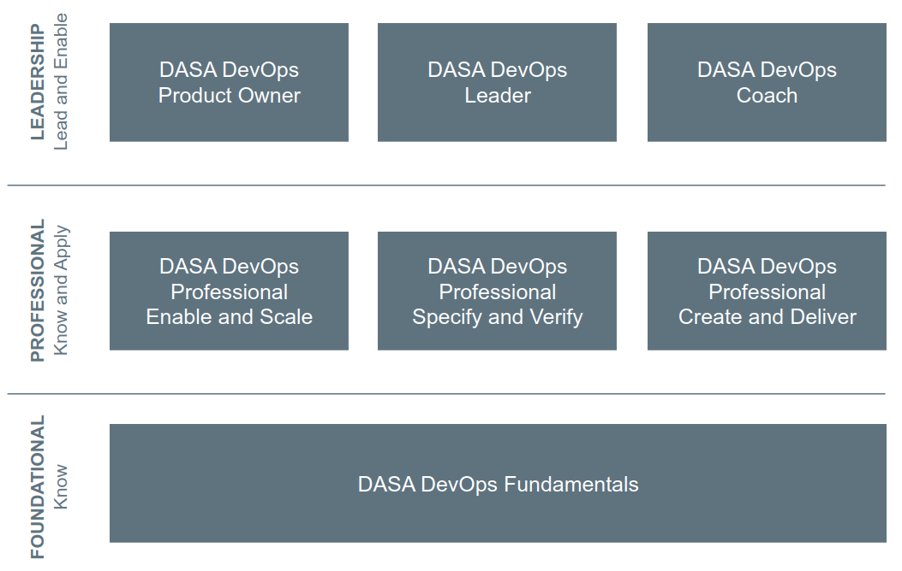

# Module 9 - Measuring the Performance - The Next Steps

## Objectives

* Analyze the existing situation of an organization.
* Take the necessary actions to improve its performance.

---

## Topic 1 - Analyze the Current Situation

### **Step 1: Map the Context**

The first step for analyzing the current situation is to study the existing team composition from the DevOps perspective. DevOps requires organizing the teams in a new way. You can utilize the three design criteria for an autonomous team to do the analysis and organization.

The three design criteria or factors or aspects are:

1. **Customer**: the value that customers derive from the different types of services.

2. **Technology Stack**: the extent of the technology stack that is necessary to deliver the service.

3. **Knowledge**: knowledge and skills required in the team considering the defined value and the service or services.

### **Step 2: Assemble the Team**

DevOps requires forming a Business System team or Platform team. The process can initially look like gathering people with some specialization similar to traditional IT roles. However, the understanding of the product (or service) and the associated value enables you to know whether you are forming a Business System team or Platform team.

Identifying and knowing the knowledge and skills that the team requires is just the starting point and brings with it several challenges.

* **Understanding of Expectations**: it is necessary to ensure each team member is product-focused and understand the expectations of the new team - delivering the product or service to the customer.

* **Purpose and Goals**: the task does not end up just forming a team. It involves defining the purpose and creating challenging goals for the team to produce the required business value.

* **Behavior and Beliefs**: one of the most difficult aspects is making people understand the value of throwing away the old ingrained behaviors and beliefs, such as the production environment is for the operations people.

* **Number of People**: finalizing the appropriate number of team members is not as easy as it sounds. Ineffective measurement can lead to unreliable or inaccurate calculation of workload. Beware of inefficiencies in the siloed way of working.

* **Intensive Knowledge-Sharing**: the team members often carry the experience of working in the traditional departments. Having overlapping skills and knowledge within the team is, therefore, difficult. Team members can reach the desired level of skills and knowledge through intensive knowledge sharing.

### **Step 3: do the DASA Competence Scan**

The last step of analyzing the current situation is to identify the competence improvement areas for each team member. The following steps will help you perform this analysis:

1. Ensure each team member does the DASA Competence Scan available on their website.
2. Allow team members to share their scan results with the team. Bringing the results of all scans help identify the existing capabilities of the team.
3. Identify the improvement areas for each team member to help them become more T-shaped. It enables the team to achieve the capabilities required for producing the defined value.

> **DASA Competence Scan**: https://scan.devopsagileskills.org/

### **Topic Summary**

Knowing various concepts of DevOps is not sufficient for a successful DevOps transformation.

"Where and how to start with it?" requires organizations or teams to first analyze the current situation by performing the following steps:

1. Map the Context.
2. Assemble the Team.
3. Do the DASA Competence Scan.

---

## Topic 2 - Improve Incrementally

### **Step 1: Train the Team**

DASA offers a complete set of training that helps organizations in acquiring the knowledge required to be effective in a DevOps team and effective in leading these teams.

The DASA competence model enables team members to achieve the desired level of capabilities required to be working in a DevOps team. We have already discussed the competence model in Module 3.

### **Step 2: Focus on Cultural Elements**

Forming team is not sufficient. Working as a team requires its members and leaders to focus on embedding the cultural elements. The four primary elements that a team needs to consider are:

* **Teambulding and Collaboration** to develop practices to encourage collaboration and openness, such as stand-ups, retrospectives, and planning sessions.

* **Continuous Improvement and Problem-Solving** to support each other to address small problems or investigate big ones regularly.

* **Courage and Experimentation** to define and plan the experiments to improve the workflow through the team.

* **Leadership and Feedback** to organize customers' feedback to understand what they think of the product or service.

People often think embedding the cultural elements is quite simple. However, moving away from traditional behavioral patterns is difficult and requires time and dedication.

The primary consideration is ensuring openness within the team so that they can openly discuss the value of the cultural elements.

The other one is their will to adopt the culture change, ignoring its potentially disruptive effect.

### **Step 3: Improve the Flow of Work**

The ultimate aim of DevOps is to achieve high-performance (delivering more value to customers more quickly and at a higher level of quality) by improving the flow of work throughout the organization.

The concepts covered in this course directly or indirectly focus on the ultimate aim of DevOps (automation, problem-solving, increasing deployment frequency, shortening processes) require removing waste (or non-value-add activities) from the service creation and delivery system, leading to a significant decrease in the cost of delivering the service.

### **Topic Summary**

After analyzing the current situation, the DevOps transformation focuses on improving incrementally by performing the following steps:

1. Train the Team.
2. Focus on Cultural Elements.
3. Improve the Flow of Work.

---

## Module Summary

In this module, I have learned:

* ...
* ...
* ...
* ...

